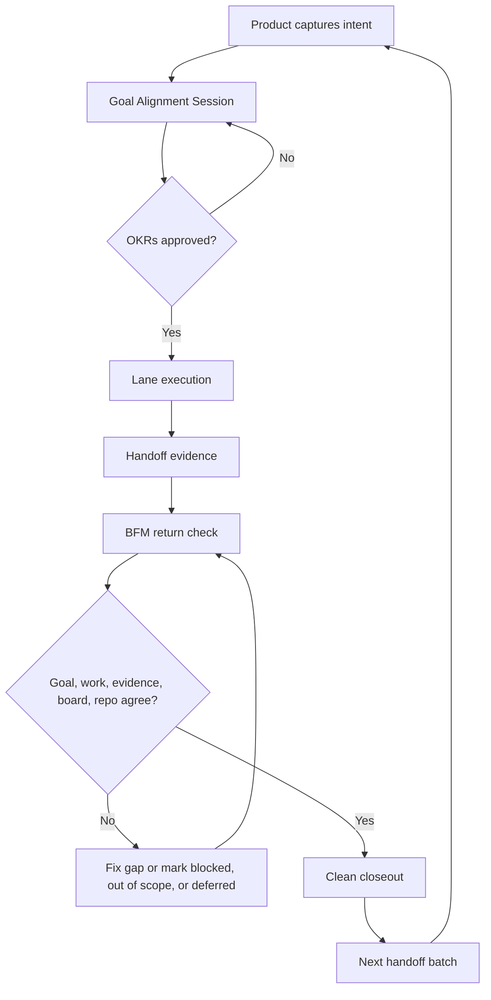

# FB-Lane: Loop Engineering for AI Work

AI agents execute fast. Product work still fails when they do not return to the
goal, the evidence, the board, and the real repo state.

FB-Lane is a lightweight implementation of **Loop Engineering**: a way for a
Product Lead to approve the goal, let specialist lanes execute, and force the
work back through evidence before anything is called done.

[Loop Engineering deep dive](docs/loop-engineering.md) | [FAQ](FAQ.md) |
[Setup](docs/setup.md) | [Changelog](CHANGELOG.md)

## The Thesis

Codex, Claude Code, and Antigravity already provide powerful agent execution.
The missing layer is usually not speed. It is alignment.

Without a loop, parallel AI work drifts:

- goals change in chat but not in the repo
- Design, Tech, and Business make different assumptions
- handoffs exist but are not reflected in source
- tests pass while the product promise remains incomplete
- Product has to reconstruct status from chat history

Loop Engineering keeps five things aligned:

1. the approved goal
2. the work that lanes execute
3. the evidence they return
4. the board state Product uses to sequence
5. the repo truth in source, docs, tests, and git

FB-Lane gives that loop a small set of files and commands: `PROJECT_BOARD.md`,
lane handoffs, file claims, `doctor`, and BFM/Product closeout checks.

## The Core Loop



For non-trivial work, BFM does not start by coding. It starts with a **Goal
Alignment Session**:

- Product proposes an `Objective`
- Product proposes measurable `Key Results`
- Product defines the `Definition of Done`
- Product names the `Gate / Review Point`
- Product records `Approval: pending`
- The user approves or changes it
- BFM executes only after `Approval: approved`

After approval, BFM changes approach, scope, or sequence to fit the OKR. It does
not silently rewrite the approved goal.

## Why Product Leads Care

FB-Lane is for the Product Lead who wants agent speed without becoming the human
traffic controller.

It makes these questions visible in the repo:

- What are we trying to achieve?
- Who owns this slice?
- Which files are safe to edit?
- What evidence proves the work met the goal?
- What is blocked, deferred, or out of scope?
- What can Product merge or release?

The point is not to add ceremony. The point is to make the return loop explicit
enough that agents cannot finish by saying "done" when the board, source, docs,
or tests say otherwise.

## How FB-Lane Implements The Loop

| Loop need | FB-Lane mechanism |
|---|---|
| Approved goal | `Goal Alignment Session` block in `PROJECT_BOARD.md` |
| Role clarity | FB-Product, FB-Tech, FB-Design, and FB-Business lanes |
| Collision control | File claims and optional worktrees |
| Durable handoff | `docs/handoffs/<task-id>.md` |
| Evidence return | `OKR Fit`, caveats, and Definition of Done evidence |
| Health check | `node tools/fb-lane.cjs doctor` |
| Integration | BFM/Product reconciliation before sequencing or merge |
| Closeout | Explicit status: implemented, already done, blocked, out of scope, or explicitly deferred |

## Roles Inside The Loop

| Lane | Owns | Boundary |
|---|---|---|
| FB-Product / BFM | Goal approval, sequencing, tradeoffs, integration, staging/live decisions. | Gives direction and owns closeout; does not execute other lanes' source work by default. |
| FB-Tech | App logic, APIs, schemas, auth, integrations, migrations, tests, reliability. | Does not own product copy or visual design decisions. |
| FB-Design | UI, CSS, layout, icons, responsive behavior, visual QA. | Does not own backend logic, schemas, or auth. |
| FB-Business | Positioning, onboarding copy, pricing, marketing text, docs. | Read-only on application code unless Product explicitly assigns implementation. |

## When To Use It

Use FB-Lane when the work has any of these risks:

- multiple agent threads or worktrees are active
- Tech, Design, Business, and Product concerns are mixed
- file collisions are plausible
- handoffs need to survive context loss
- Product must sequence multiple lane outputs
- you need evidence before merge or release

Skip it for:

- one-thread fixes
- read-only questions
- tiny quick edits with no ownership split
- independent experiments where native worktrees are enough

## Start Here

Choose the platform guide for your tool:

| Platform | Guide | Best for |
|---|---|---|
| Antigravity 2.0 | [platforms/antigravity/README.md](platforms/antigravity/README.md) | Native multi-agent orchestration and isolated worker lanes. |
| Claude Code | [platforms/claude-code/README.md](platforms/claude-code/README.md) | `@agent` / `/agents` lane workflows with MCP and optional worktrees. |
| Codex | [platforms/codex/README.md](platforms/codex/README.md) | Codex plugin, skills, MCP, subagents, and worktrees. |

Fallback bootstrap options live in [docs/setup.md](docs/setup.md). The operating
model lives in [docs/loop-engineering.md](docs/loop-engineering.md).

## CLI Quick Reference

Run from a project root that has been bootstrapped with FB-Lane:

| Command | Purpose |
|---|---|
| `node tools/fb-lane.cjs status` | Show tasks, owners, and file claims. |
| `node tools/fb-lane.cjs doctor` | Read-only loop health check for board, rules, locks, handoffs, and OKR approval. |
| `node tools/fb-lane.cjs claim <id> <lane> [locks] [--worktree]` | Claim work and lock files. |
| `node tools/fb-lane.cjs quick <lane> <locks> [desc]` | Create and claim a quick `TASK-Q-####` task. |
| `node tools/fb-lane.cjs submit <id> [staging_url]` | Submit work for Product/Captain review. |
| `node tools/fb-lane.cjs merge <id>` | Product/Captain merge path after review. |
| `node tools/fb-lane.cjs bootstrap` | Manual setup path. See [docs/setup.md](docs/setup.md). |

## Codex Plugin Upgrade

For an existing Codex install, refresh from the FB-Lane marketplace:

```bash
codex plugin add fb-lane-coordination@fb-lane
```

Start a new Codex thread after reinstalling so newly loaded skills and MCP tools
pick up the refreshed plugin context. Codex may keep older cache folders on disk;
the active version is the one shown by:

```bash
codex plugin list | rg "fb-lane-coordination"
```

## More

- [Loop Engineering deep dive](docs/loop-engineering.md)
- [Setup alternatives](docs/setup.md)
- [FAQ](FAQ.md)
- [Plugin package](plugins/fb-lane-coordination/README.md)
- [Example app](examples/my-app/README.md)
- [License](LICENSE)
