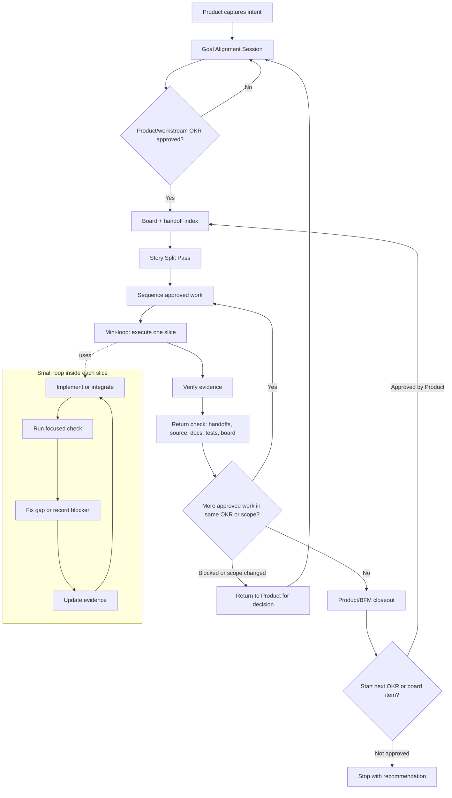

# FB: AI Loop Engineering for Everyday People

AI agents execute fast. Product work still fails when they do not return to the
goal, the evidence, the board, and the real repo state.

FB is a lightweight implementation of **Loop Engineering**: a way for a
Product Lead to approve the goal, let specialist lanes plan, launch BFM for
execution, and force the work back through evidence before anything is called
done.

[Loop Engineering deep dive](docs/loop-engineering.md) |
[Versioning](docs/versioning.md) | [FAQ](FAQ.md) | [Setup](docs/setup.md) |
[Maintenance](docs/maintenance.md) | [Changelog](CHANGELOG.md)

Current model name: **FB 0.2.0-beta: AI Loop Engineering for Everyday People**.
Current plugin build: Codex `0.2.0-beta+codex.20260716052513`. See
[Versioning](docs/versioning.md).

## The Thesis

Codex provides powerful agent execution. The missing layer is usually not speed.
It is alignment.

## First-Project And Review Contract

For a first project or new non-trivial objective, Product starts with this user-facing brief before requesting lane output or clarification questions:

### Project Start Brief

- **What you asked for:** <plain-language outcome>
- **Your decisions:** <choices already made>
- **Assumptions to confirm:** <only assumptions that could change the plan>
- **What FB will plan:** <bounded planning work>
- **Out of scope:** <explicit exclusions>
- **Success looks like:** <observable outcome>
- **Progress:** <current stage and what is complete>
- **Next action:** <one immediate Product action or user decision>

### How FB works

1. **Lanes plan:** Product selects only relevant lanes; each answers a distinct question.
2. **Product prepares:** Product turns those plans into one build brief and recommends a path.
3. **You approve:** Product asks you to approve that build brief before anything is built.
4. **BFM builds:** Only after explicit `$bfm` does BFM build the approved brief.

Selected lanes must state their distinct question and the decision or risk their answer changes. Skipped lanes are named as `Skipped lanes: <lanes and reason>`. Every clarification question gives **Why this matters**, a **Recommended default**, and **What changes if you choose differently**.

When review is available, Product sends a short **Test This Now** packet with **Outcome type**, **Direct links**, **Exact steps and expectations**, **Pass criteria**, **Known limits**, and a **Failure-report format** (what happened, what was expected, link or screenshot, and environment). If review access is missing, the packet is `Status: blocked — review access is missing`, never ready to test.

FB currently supports Codex only. The Claude Code and Antigravity
integrations are paused; contributors who want to revive one can follow the
[paused-integration checklist](docs/paused-integrations.md).

Without a loop, parallel AI work drifts:

- goals change in chat but not in the repo
- Design, Tech, and Business make different assumptions
- handoffs exist but are not reflected in source
- tests pass while the product promise remains incomplete
- Product has to reconstruct status from chat history

Loop Engineering keeps five things aligned:

1. the approved goal
2. the work that BFM executes from approved lane plans
3. the evidence they return
4. the board state Product uses to sequence
5. the repo truth in source, docs, tests, and git

FB gives that loop a small set of files and commands: `PROJECT_BOARD.md`,
`docs/handoffs/index.md`, lane plans/handoffs, file claims during BFM execution,
`doctor`, and BFM/Product closeout checks.

Every BFM run includes a story-split check before prioritization: if the batch
mixes lanes, locks, risks, gates, review surfaces, blocked work, and ready work,
Product/BFM splits it into smaller stories and sequences only the unblocked
slice; otherwise it says `No split needed` and continues.

The operating rule is awareness, isolation, integration: `PROJECT_BOARD.md` and
`docs/handoffs/index.md` create shared awareness like a standup;
branches/worktrees isolate execution like separate desks; BFM integrates
outcomes like Product/release review. Worktrees do not replace coordination: no
private worktree should produce a huge unannounced diff, edit source without
board/lock awareness, or close while multiple outputs still need BFM
reconciliation.

FB is not CI/CD. It includes CI readiness evidence for Product/BFM
closeout: automated merge safety, manual release control.

FB evals are lightweight behavior checks for the agents themselves. They
answer: did Product/BFM run the loop correctly? Keep them as Markdown
scorecards until repeated failures justify automation. Use the generic
scorecard shape in `docs/evals/agent-behavior-scorecard-template.md` only when
`Loop Learning` points to a repeated agent-behavior failure. A retro or
scorecard may recommend at most one small guardrail for each repeated pattern.
It must not create an eval runner, dashboard, numeric score, CI eval job, larger
`doctor`, per-task OKRs, or quick-task ceremony unless Product/BFM separately
proposes that heavier option with tradeoffs and gets explicit approval.

When Product/BFM sees the same workflow failure, stale state, missing evidence,
or preventable rework repeat, it should propose one small guardrail for approval
instead of waiting for the user to notice it again.

At closeout, Product/BFM records a tiny `Loop Learning` check: feedback captured,
whether the pattern repeated, whether tooling is needed (`none`, `propose
guardrail`, `propose automation`, or `propose eval`), and whether Product
approval is needed. This is the escalation trigger, not a new command.

Approval autonomy is phased. Start in **Shadow Approval**: Product/BFM still
asks the user, but records `Would self-approve: yes/no` and the reason. Product/BFM
may recommend moving to bounded self-approval after repeated matches, but the
user approves the phase change. Risky surfaces such as live deploys, secrets,
payments, auth/privacy, destructive data, provider state, unclear goals, failed
evidence, scope changes, and stale dirty state never self-approve.

For already-approved safe Product/BFM work, the loop should keep moving through
routine diagnosis, implementation, verification, board/handoff updates, commit,
staging, and cleanup until solved or explicitly blocked. It reports after
closeout. It still stops for hard gates such as live deploys, secrets,
payments, auth/privacy, destructive data/provider state, new scope or OKR
changes, unclear goals, lock conflicts, failed evidence needing risk acceptance,
or an explicit pause.

Before asking the user to test, Product/BFM writes a `## Verification Handoff`:
the candidate branch or commit, test plan link, exact commands and environments,
current results, runnable evidence links, manual pass criteria, recovery already
attempted, and the next Product/BFM recovery action. A missing or stalled check
is pending or blocked evidence, not a reason to hand routine recovery to the
user. The user is involved only for a genuine approval or external manual,
device, or account gate.

Repeated Git or file-read instability enters a bounded workspace-health check,
including a 15 GiB free-capacity default (unless a stricter project policy is
documented), a 15-second timeout for each Git probe, and File Provider or
synchronized-storage ancestry where relevant. A second failure in the same
checkout triggers clean-clone recovery; damaged Git/index/worktree metadata is
never migrated as a shortcut.

When the user says `BFM`, blocker handling is part of that loop. Product/BFM
flags each blocker, recommends how to address it, executes the recommended safe
unblock path inside the approved scope, and keeps going until every task is done,
explicitly deferred, out of scope, or blocked by a real stop point. Physical
devices and other manual external actions are real stop points, but routine
sequencing, checks, docs, commits, staging, and cleanup are not.

## From v1 To Latest

v1 was a four-lane coordination plugin: useful for assigning Product, Tech,
Design, and Business work without collisions. The latest model is Loop
Engineering: a Product/BFM return loop that keeps approved goals, lane plans,
evidence, board state, and repo truth aligned before closeout.

The short before/after table is in [docs/versioning.md](docs/versioning.md).

## FB Framework OKR

This is the framework north star, not a project ritual.

**Objective:** Help Product Leads run multi-agent work without losing alignment
between goals, evidence, board state, and repo truth.

**Directional Key Results:**

- Reduce serious coordination startup context by roughly 60-70% when it is safe
  to do so, while preserving blockers, gates, and dependencies.
- Account for every non-quick BFM handoff at closeout as `implemented`,
  `already done`, `blocked`, `out of scope`, or `explicitly deferred`.
- Keep new bootstrapped projects on the simple contract:
  `PROJECT_BOARD.md` is truth, `docs/handoffs/index.md` is routing, and detailed
  handoffs are detail.

**Definition of Done:** FB docs, skills, bootstrap templates, `doctor`, and
Product/BFM closeout guidance all support the return loop without per-task OKR
generation, numeric loop scoring, a giant `doctor`, a second-board handoff
index, or quick-task ceremony.

## The Core Loop



The outer loop is the Product loop: approve the goal, sequence against the
board, execute through BFM, return to evidence, and close only when the board,
source, docs, tests, and git state agree. The inner mini-loop is the slice loop:
build, check, fix or record the blocker, and update evidence.

BFM may keep taking the next slice only inside the approved OKR or scope. A new
unrelated board item starts only after Product approval, unless a separately
approved self-approval phase allows it.

For non-trivial work, BFM does not start by coding. It starts with a **Goal
Alignment Session**:

- Product discusses a Product/workstream `Objective`
- Product discusses measurable `Key Results`
- Product defines the `Definition of Done`
- Product names the `Gate / Review Point`
- Product/BFM proposes stable lane OKRs where lanes are relevant
- The user explicitly approves or changes it
- Product records the approved OKR in the board
- Lane mini-loops return evidence against their lane OKR and the Product/workstream OKR
- BFM executes approved markdown plans only against that stable OKR tree

After approval, BFM changes approach, scope, or sequence to fit the OKRs. It does
not dynamically create or rewrite OKRs during execution; any OKR change requires
discussion and explicit user approval.

Directional targets are not hard pass/fail numbers. Product/BFM uses a loop
health flag at closeout: `healthy`, `watch`, `needs Product review`, or
`blocked`.

## Plan-Only Workstreams

Normal workstream threads are read-only planning lanes. Product, Tech, Design,
and Business may ask questions, investigate, critique, and write markdown
plans/handoffs. They must not edit application/source code, create implementation
branches, commit, submit, merge, deploy, or change provider state from ordinary
workstream chat.

Product is source-read-only too. Product may edit coordination markdown:
`PROJECT_BOARD.md`, plans, handoffs, OKRs, Definition of Done, sequencing notes,
and closeout notes.

Source changes happen only inside a Product-launched **BFM (Build Flow
Manager)** execution run. BFM reads the approved plans, checks whether they
should be split into smaller stories before prioritizing, sequences work, claims
files, dispatches implementation workers, verifies evidence, and returns to the
board/docs/source/git state before closeout.

## Sidechat-to-Main Prompt Handoff

Sidechats are discussion and planning spaces by default. Use them to ask questions, compare options, review tradeoffs, produce recommendations, and generate a paste-ready handoff for their originating parent main thread. They do not own board updates, handoff files, source changes, commits, validation, or closeout; Product/BFM retains those execution and durable-record responsibilities.

Parent-thread routing is mandatory: follow [the canonical sidechat parent-thread rule](docs/sidechat-parent-thread-routing.md). Do not infer another destination from role, project, name, recency, or Product/BFM status. If the parent is unavailable, return the handoff to the user; a non-parent main treats it as ordinary user-provided context.

A sidechat prompt is not source of truth until Product/BFM records it in `PROJECT_BOARD.md`, the relevant handoff, or durable docs. Keep tiny questions lightweight: no new command, dashboard, `doctor` expansion, source behavior, or required ceremony is needed for a quick clarification.

When a sidechat prepares work for Product/BFM, use this output shape:

- Decision summary:
- Scope:
- Out of scope:
- Recommended owner/lane:
- Files/docs likely affected:
- Acceptance criteria:
- Gates/risks:
- Exact instruction for Product/BFM:


## Why Product Leads Care

FB is for the Product Lead who wants agent speed without becoming the human
traffic controller.

It makes these questions visible in the repo:

- What are we trying to achieve?
- Who owns this slice?
- Which files are safe to edit?
- What evidence proves the work met the goal?
- What is blocked, deferred, or out of scope?
- What can Product merge or release?

The point is not to add ceremony. The point is to make the return loop explicit
enough that agents cannot finish by saying "done" when the board, source, docs,
or tests say otherwise.

## How FB Implements The Loop

| Loop need | FB mechanism |
|---|---|
| Approved Product/workstream OKR | `Goal Alignment Session` block in `PROJECT_BOARD.md` |
| Goal shortcut | `/goal` opens the same Product/BFM Goal Alignment Session; it is not a second goal system |
| Stable lane OKRs | Standing Tech, Design, Business, and Product quality anchors |
| Role clarity | FB-Product, FB-Tech, FB-Design, and FB-Business lanes |
| Collision control | File claims plus named branches/worktrees for isolated execution |
| Cheap context lookup | `docs/handoffs/index.md` routes to detailed handoff files |
| Lane revisit summary | `docs/workstreams/<lane>.md` shows already-executed work, pending items, and evidence links |
| Durable plan/handoff | `docs/handoffs/<task-id>.md` or project plan markdown |
| Evidence return | `Workstream Goal`, `Lane OKR Fit`, `User Approval Needed`, `Mini-loop Evidence`, and `Evidence Against Product OKR` |
| Health check | `node tools/fb-lane.cjs doctor` |
| Agent behavior evals | Optional Markdown scorecards for repeated loop failures |
| Execution gate | Product-launched BFM run |
| Explicit plan phrase gate | `PLEASE IMPLEMENT THIS PLAN` outside Product/BFM requires confirmation before source edits |
| Frontend visual planning | Visible UI plans default to a pre-build preview: browser screenshot/mockup, imagegen asset/style option, or skip with reason |
| Integration | BFM/Product reconciliation before sequencing or merge |
| Product/BFM closeout visibility | Detailed handoffs get `## Product/BFM Closeout` before workstream cards are refreshed |
| Closeout | Explicit status plus loop health flag: `healthy`, `watch`, `needs Product review`, or `blocked` |
| Loop learning | Closeout field that escalates repeated friction to a guardrail, automation, or eval proposal |
| Approval autonomy | Phased from shadow approval to bounded self-approval only after user-approved promotion |
| Execution continuation | Product/BFM keeps going on approved safe work, including safe unblock paths, until solved or blocked |

## Roles Inside The Loop

| Lane | Owns | Boundary |
|---|---|---|
| FB-Product / BFM | Goal approval, sequencing, tradeoffs, integration, staging/live decisions. | Product is source-read-only; source changes start only through a Product-launched BFM run. |
| FB-Tech | Technical investigation, risks, implementation plans, tests to run. | Plan-only in normal workstream chat; source edits only as a BFM execution worker. |
| FB-Design | UI critique, layout plans, visual QA plans, asset guidance. | Plan-only in normal workstream chat; source edits only as a BFM execution worker. |
| FB-Business | Positioning, onboarding copy, pricing, marketing text, docs. | Read-only on application/source code; records integration targets for BFM. |

## When To Use It

Default to normal/simple coding when the request is one-thread and has no listed
coordination trigger. Skip FB for:

- read-only questions
- code explanations
- tiny fixes
- isolated edits
- independent experiments where native worktrees are enough

Use **FB light** when the objective mentions handoffs, board items, lanes,
BFM, Product, Design, Business, coordination files such as `PROJECT_BOARD.md` or
`docs/handoffs/`, board-locked files, multiple threads/agents/workstreams, or
durable context that must survive chat loss. Keep it lightweight: read the
board/locks, claim or note only the exact files needed, and avoid ceremony unless
another lane or Product must continue it.

Escalate to **Product/BFM** when the work requires deciding what to build,
sequence, defer, approve, merge, release, stage, or launch; crosses pricing,
payments, trials, subscriptions, promo codes, auth, privacy, analytics, secrets,
deploy, staging, or live gates; touches camera/capture/save/export or another
core product flow; or needs multiple lane outputs reconciled before source
changes.

## Start Here

Use FB with Codex:

| Platform | Maturity | Guide | Best for |
|---|---|---|---|
| Codex | Public beta | [platforms/codex/README.md](platforms/codex/README.md) | Codex plugin, skills, MCP, subagents, and worktrees. |

Fallback bootstrap options live in [docs/setup.md](docs/setup.md). The operating
model lives in [docs/loop-engineering.md](docs/loop-engineering.md).

## CLI Quick Reference

Run from a project root that has been bootstrapped with FB:

| Command | Purpose |
|---|---|
| `node tools/fb-lane.cjs status` | Show tasks, owners, and file claims. |
| `node tools/fb-lane.cjs doctor` | Read-only loop health check for board, rules, handoff index, locks, handoffs, and OKR approval. |
| `node tools/fb-lane.cjs claim <id> <lane> [locks] [--worktree]` | BFM execution worker claims work and locks files. |
| `node tools/fb-lane.cjs quick <lane> <locks> [desc]` | Create a tiny BFM execution task; skips OKR approval, not the source-change boundary. |
| `node tools/fb-lane.cjs submit <id> [staging_url]` | Submit work for Product/Captain review. |
| `node tools/fb-lane.cjs merge <id>` | Product/Captain merge path after review. |
| `node tools/fb-lane.cjs bootstrap` | Manual setup path. See [docs/setup.md](docs/setup.md). |

The board/index/handoff split is deliberate: `PROJECT_BOARD.md` is truth for
status, sequencing, gates, ownership, and locks; `docs/handoffs/index.md` is
routing; detailed handoffs are detail. The index should stay compact with
`Task / Topic`, `Lane`, `Status`, `Depends / Blocks / Gate`,
`Checks / Evidence`, and `Detail`. Keep full OKRs, QA checklists, plans, logs,
rationale, copy variants, and implementation detail in detailed handoffs.

`docs/workstreams/<lane>.md` is the lane revisit card. Product/BFM first updates
the detailed handoff with `## Product/BFM Closeout`, then refreshes the card
after executing or explicitly deferring a lane handoff so a returning Tech,
Design, Business, or Product thread can see what already happened, what remains
pending or blocked, and where the evidence lives. It is a summary only, not a
second board.

Before source execution, read board/status/locks and the relevant handoff index.
During isolated work, name the task, branch/worktree, lane, and locked files in
the handoff or board update. At closeout, report whether the branch/worktree is
clean, merged, stale, blocked, or intentionally dirty.
If checks touched external services, also name test mode, created records or
resources, cleanup evidence, or the pending cleanup gate.

## Codex Plugin Upgrade

For an existing Codex install, refresh from the FB marketplace:

```bash
codex plugin add fb-lane-coordination@fb-lane
```

Start a new Codex thread after reinstalling so newly loaded skills and MCP tools
pick up the refreshed plugin context. Codex may keep older cache folders on disk;
the active version is the one shown by:

```bash
codex plugin list | rg "fb-lane-coordination"
```

For same-version docs-only updates, also verify the active installed cache
contains the expected new wording instead of trusting the version string alone.
If the cache is stale after an update, reinstall the plugin; where the platform
supports it, preserve plugin data during uninstall/reinstall.

## More

- [Loop Engineering deep dive](docs/loop-engineering.md)
- [Versioning and v1 before/after](docs/versioning.md)
- [Setup alternatives](docs/setup.md)
- [Paused integrations](docs/paused-integrations.md)
- [FAQ](FAQ.md)
- [Plugin package](plugins/fb-lane-coordination/README.md)
- [Example app](examples/my-app/README.md)
- [License](LICENSE)
