# FB

**AI Loop Engineering for Everyday People**

**FB is a Codex plugin that connects six product workstreams in one continuous
delivery loop. Each workstream investigates part of the problem; `$bfm` brings
their ready recommendations together, prioritizes the work, directs Codex
implementation, runs automated checks, and prepares the result for release.**

FB means **Focus Bridge**: it bridges discussion, evidence, implementation, and
delivery.

## Problems FB solves

| Common problem | What FB does |
|---|---|
| Product decisions are scattered across chats | Actionable findings become durable handoff MD files. |
| User evidence and assumptions get mixed together | Product/User labels evidence, decisions, and assumptions separately. |
| Teams build before resolving important unknowns | Discovery investigates uncertainty before implementation. |
| Bug reports lack reproduction or severity | Bugs turns reports into observable, prioritized evidence. |
| Business, design, and technical advice conflicts | Product reconciles it during `$bfm`. |
| Users must manually combine agent output | `$bfm` scans and sequences all six workstreams. |
| Tests fail and responsibility returns to the user | FB owns bounded diagnosis and repair. |
| Nobody knows whether work is ready | FB reports automated verification, optional links, and **Ready to ship**. |
| AI releases without final approval | Only **Push Live** authorizes merge or deployment. |

## One big loop, six mini-loops

| Workstream | Its question |
|---|---|
| Product/User | What user outcome should we deliver? |
| Business | Should and how can this succeed commercially? |
| Design | How should the experience work and feel? |
| Tech | How can this be built safely and reliably? |
| Discovery | What do we still need to learn? |
| Bugs | What is broken and how do we prove it? |

Each relevant workstream follows:

```text
Question → Investigate → Gather evidence → Recommend → Create handoff MD
```



```mermaid
flowchart LR
    U["Goal or feedback"] --> W["Six workstream mini-loops"]
    W --> H["Ready handoff MD files"]
    H --> B["Say $bfm"]
    B --> P["Product reconciles and prioritizes"]
    P --> C["Codex implements"]
    C --> T["FB tests and repairs"]
    T --> R["Optional review links"]
    R --> S["Ready to ship"]
    S --> L["Say Push Live"]
    L --> D["Merge and deploy"]
    D --> F["Results, feedback, discoveries, and bugs"]
    F --> W
```

A workstream with nothing useful records **None relevant**. It does not invent
work merely to participate.

Build For Me (BFM) is the execution step. It begins only after Product approval
and explicit `$bfm`; see [start and approval](docs/fb/start.md).

## Install

```bash
codex plugin marketplace add friedbeef1/fb-lane-coordination
codex plugin add fb-lane-coordination@fb-lane
```

## Use FB

1. Open your project in Codex and say: `Set up FB in this project.`
2. Discuss your goal or question in the relevant workstream chats. This keeps different concerns clear without forcing every workstream to participate.
3. When a discussion becomes actionable, say: `Create a handoff MD for Product/BFM.` This preserves the recommendation and evidence outside the chat.
4. Say `$bfm`. Product scans all six workstreams, reconciles ready handoffs, prioritizes the sequence, and directs Codex implementation.
5. FB runs automated checks and owns bounded repair. Review optional links only when useful.
6. When FB reports **Ready to ship**, say **Push Live** to authorize merge and deployment.

## Honest comparison

| System | Strongest emphasis | Better choice when… |
|---|---|---|
| [Vanilla Codex](https://openai.com/codex/) | Execute software work | The task is clear, isolated, and does not need durable product coordination. |
| [Kurrent Capacitor](https://capacitor.kurrent.io/docs/getting-started/what-is-capacitor/) | Automatically capture, observe, recall, and evaluate agent sessions | Comprehensive automatic session history and telemetry are the priority. |
| [GitHub Spec Kit](https://github.github.com/spec-kit/) | Specification-driven development | You want a structured specification workflow around implementation. |
| [BMAD](https://github.com/bmad-code-org/BMAD-METHOD) | Role-based agile AI development | You want a broad methodology with specialized agent roles. |
| **FB** | Define, authorize, coordinate, verify, and explain a product outcome | You need six product perspectives connected to approved decisions, Codex execution, testing, and a human release boundary. |

FB also provides curated session recall and evaluation, but it deliberately does
not require comprehensive transcript capture or hosted telemetry. See
[Why FB](docs/why-fb.md) for the detailed comparison and real examples.

## Learn more

- [FAQ](FAQ.md)
- [How the harness works](docs/fb/README.md)
- [Start and approval](docs/fb/start.md)
- [Workflow and `$bfm`](docs/fb/workflow.md)
- [Evidence and review](docs/fb/evidence.md)
- [Safety, sidechat routing, and recovery](docs/fb/guardrails.md)

Technical identifiers such as `fb-lane`, `fb-lane-coordination`, plugin IDs,
commands, MCP names, and paths remain unchanged.
