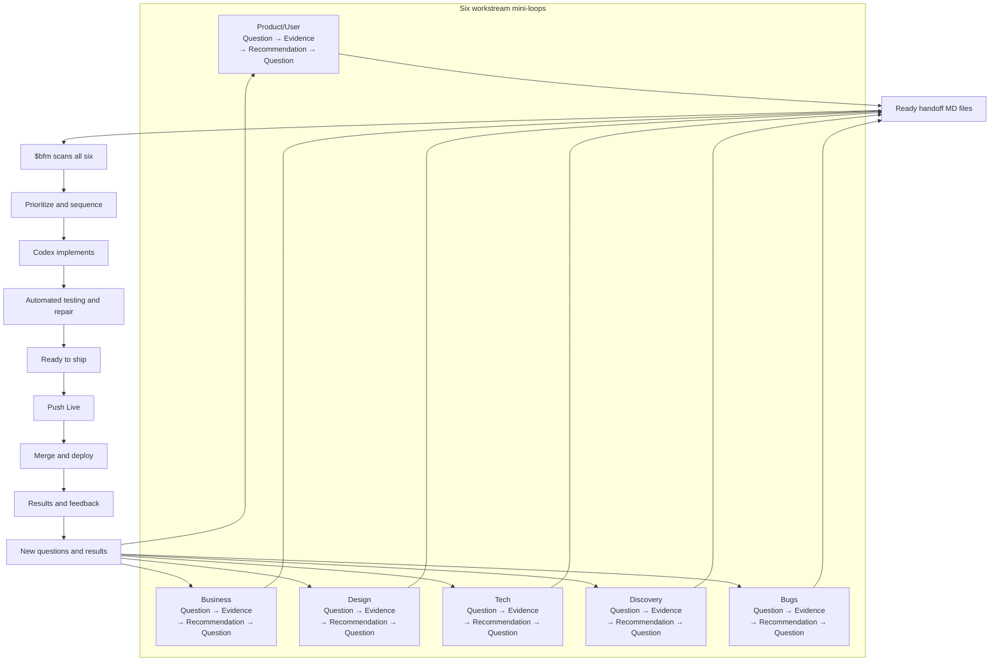

# FB

[Overview](README.md) · [Agile Teams](docs/fb-for-agile-teams.md) · [Why FB](docs/why-fb.md) · [Full Loop](docs/fb/full-loop.md)

**AI Loop Engineering for Everyday People**

Current Codex release: **FB 0.5.0-beta**
(`0.5.0-beta+codex.20260728113402`).

**FB is a Codex plugin that connects six product workstreams in one continuous
delivery loop. Each workstream investigates part of the problem; `$bfm` brings
their ready recommendations together, prioritizes the work, directs Codex
implementation, runs automated checks, and prepares the result for release.**

FB means **Focus Bridge**: it bridges discussion, evidence, implementation, and
delivery.

FB 0.5 adds an optional repository-local
[generic agent control loop](docs/fb/control-loop.md): deterministic routing,
baseline comparison, layered QA gates, and bounded diagnosed configuration
evolution. These are capabilities inside the same six-workstream delivery
model, not additional mandatory agents.

## Measured repair-efficiency evidence

In one prospective benchmark of **six paired historical tasks**, Efficient-Graph
FB used **23.6% less wall time** and **15.8% fewer provider-reported tokens**
than fresh Vanilla Codex runs. Repair tokens fell 69.3%, and accepted outcomes
were 3/6 versus 1/6. The saving came from preventing unnecessary repairs and
giving earned repairs fresh criterion-specific delta context—not from a cheaper
first pass.

This is directional evidence for that task mix, **not a universal claim** that
FB always wins. See the [method, fixture-level results, cost estimate, and
limits](docs/benchmarks/repair-efficiency/README.md).

These are product-delivery and coordination gaps that can arise around ordinary
Codex use, not defects in Codex itself.

| Codex issue | Codex problem solved by FB |
|---|---|
| Important decisions remain scattered across chats | FB turns actionable decisions and evidence into repository-local handoff MD files. |
| Codex may start building before the goal and boundaries are clear | FB requires relevant workstream handoffs and approved ready scope before `$bfm`; Product records the consolidated Project Start Brief and Build Brief during reconciliation after invocation. |
| User evidence, decisions, and AI assumptions can become mixed together | Product/User records each category separately before implementation. |
| Outputs from several Codex tasks must be combined manually | `$bfm` scans ready handoffs across all six workstreams, reconciles conflicts, and sequences the work. |
| Failed checks can return responsibility to the user | FB runs automated checks and owns bounded diagnosis and repair. |
| Progress and readiness can be difficult to interpret | FB reports Current, Next, Blocked, optional review links, and Ready to ship. |
| Codex can perform a merge or deployment when instructed, but product approval may be unclear | FB reserves merge and deployment authority for the explicit phrase **Push Live**. |

## Problems FB solves

| Common problem | What FB does |
|---|---|
| Product decisions are scattered across chats | Actionable findings become durable handoff MD files. |
| User evidence and assumptions get mixed together | Product/User labels evidence, decisions, and assumptions separately. |
| Teams build before resolving important unknowns | Discovery investigates uncertainty before implementation. |
| Bug reports lack reproduction or severity | Bugs turns reports into observable, prioritized evidence. |
| Business, design, and technical advice conflicts | Product reconciles it during `$bfm`. |
| Users must manually combine agent output | `$bfm` scans and sequences all six workstreams. |
| Tests fail and responsibility returns to the user | FB owns bounded diagnosis and repair. |
| Nobody knows whether work is ready | FB reports automated verification, optional links, and **Ready to ship**. |
| AI releases without final approval | Only **Push Live** authorizes merge or deployment. |

See the [Why FB evidence](docs/why-fb.md#pain-points-fb-is-designed-to-address)
behind these problem mappings.

## One big loop, six mini-loops

| Workstream | Its question |
|---|---|
| Product/User | What user outcome should we deliver? |
| Business | Should and how can this succeed commercially? |
| Design | How should the experience work and feel? |
| Tech | How can this be built safely and reliably? |
| Discovery | What do we still need to learn? |
| Bugs | What is broken and how do we prove it? |

Each relevant workstream follows:

For the human-team interpretation, see [Agile Teams](docs/fb-for-agile-teams.md).

```text
Question → Investigate → Gather evidence → Recommend → Create handoff MD
```



[Full FB Loop Diagram](docs/fb/full-loop.md) — handoff states, post-`$bfm`
Product reconciliation, repair, review, and release.

A workstream with nothing useful does not invent work merely to participate;
record **None relevant** only when a six-workstream scan/report requires it.

When actionable ready handoffs exist, the user says `$bfm`. Product then scans
all six, reconciles and prioritizes, creates the Project Start Brief plus Build
Brief, and BFM executes already-approved scope; see [the start
contract](docs/fb/start.md).
For substantial work, FB plans a dependency graph up front and breaks the
outcome into small verifiable slices. After `$bfm`, FB automatically creates or
reuses a linked worktree for every independent source-changing slice and can run
those agents in parallel; dependent or overlapping work stays sequential. You
do not need to create, choose, or organize implementation worktrees.
Planning-only workstreams do not receive worktrees. The overall job may run for
hours without repeatedly running broad tests between slices. After integration,
FB removes only clean, merged task worktrees; unsafe or unfinished worktrees
remain owned and visible instead of being force-deleted. See the
[automatic implementation worktree contract](docs/fb/workflow.md#automatic-implementation-worktrees).

## Install

```bash
codex plugin marketplace add friedbeef1/fb-lane-coordination
codex plugin add fb-lane-coordination@fb-lane
```

## Use FB

1. Open your project in Codex and say: `Set up FB in this project.`
2. Discuss your goal or question in the relevant workstream chats. This keeps different concerns clear without forcing every workstream to participate.
3. When a discussion becomes actionable, say: `Create a handoff MD for Product/BFM.` This preserves the recommendation and evidence outside the chat.
4. Say `$bfm`. Product scans all six workstreams, reconciles ready handoffs, prioritizes the sequence, and directs Codex implementation.
5. FB runs automated checks and owns bounded repair. Review optional links only when useful.
6. When FB reports **Ready to ship**, say **Push Live** to authorize merge and deployment.

## Comparison

| System | Good because | Gap | How FB addresses the gap |
|---|---|---|---|
| Vanilla Codex | Directly executes clear software tasks. | Decisions, evidence, priorities, verification, and release authority can remain scattered across chats. | FB captures durable handoffs, reconciles six workstreams, verifies the result, and preserves explicit release approval. |
| Git worktrees | Isolate branches and support parallel implementation. | Isolation does not determine what to build, resolve competing recommendations, or verify the product outcome. | FB connects worktree execution to approved priorities, coordinated implementation, and outcome verification. |
| Kurrent Capacitor | Automatically captures, recalls, observes, and evaluates agent sessions. | Session intelligence alone does not define the approved product outcome or own delivery authority and closeout. | FB connects curated evidence to the brief, user decisions, execution authority, testing, and closeout. |
| BMAD | Provides a broad role-based AI development methodology. | A broad methodology can require more process than a focused repository-local Codex delivery loop. | FB provides a smaller loop around ready handoffs, Codex implementation, automated verification, and explicit release approval. |
| FB | Connects six product workstreams to Codex implementation, verification, and delivery. | — | — |

References: [OpenAI Codex](https://openai.com/codex/), [Git
worktree](https://git-scm.com/docs/git-worktree), [Kurrent
Capacitor](https://capacitor.kurrent.io/docs/getting-started/what-is-capacitor/),
and [BMAD](https://github.com/bmad-code-org/BMAD-METHOD).

## When something else is genuinely a better fit

Most product work benefits from FB when decisions, implementation, verification, and release must remain connected. Another tool is a better fit only when one of these narrower conditions describes the primary goal.

| Condition | Better fit | Why |
|---|---|---|
| The task is completely specified, mechanical, disposable, finishable in one session, and needs no durable decisions, coordination, follow-up, sensitive handling, or release governance. | Vanilla Codex | It executes immediately without creating records that will never be reused. |
| A mature engineering organization already owns requirements, prioritization, CI, review, and release—and needs only native branch isolation. | Git worktrees | Worktrees provide isolation without introducing another coordination system. |
| The primary requirement is comprehensive or forensic capture of large volumes of agent-session activity across teams. | Kurrent Capacitor | Capacitor provides richer automatic session telemetry and history than FB’s curated records. |
| The organization explicitly wants a prescribed, role-heavy methodology with formal personas and lifecycle ceremonies. | BMAD | BMAD provides a broader formal methodology than FB’s repository-local delivery loop. |

If these conditions sound unusually specific, they probably are. Ordinary evolving product work still benefits from FB connecting decisions, implementation, verification, and release.

Describe the outcome and use FB normally. FB decides how much coordination, evidence, and verification the situation requires.

## How FB works with your existing stack

These are documented workflows, not built-in automatic adapters.

| Existing tool | Keep using it for | What FB adds | Integration boundary |
|---|---|---|---|
| Vanilla Codex | Reading, editing, running, testing, and explaining software work | Approved product context, coordinated handoffs, verification ownership, and release boundaries | FB is a Codex plugin; Codex remains the execution engine. |
| Git worktrees | Native branch and filesystem isolation for parallel changes | Priorities, ownership, locks, sequencing, and outcome verification | FB may use ordinary Git worktrees; it does not replace Git. |
| Kurrent Capacitor | Automatic session capture, recall, telemetry, and cross-agent history | Curated product truth tied to decisions, scope, acceptance, and closeout | Capacitor can be an optional evidence source. Important conclusions must enter FB handoffs; no automatic integration currently exists. |
| BMAD | Formal discovery, planning, role-based analysis, PRDs, architecture, and UX artifacts | Repository-local delivery, reconciliation, Codex execution, automated checks, and explicit release approval | Approved BMAD artifacts can enter FB as evidence or ready handoffs. FB remains the delivery authority to avoid competing systems of record. |

A team can use BMAD to produce a formal PRD, Capacitor to preserve detailed session history, Git worktrees to isolate parallel implementation, and Codex to write the software. FB connects the approved parts: it turns the PRD and relevant evidence into durable handoffs, sequences work across worktrees, verifies the delivered outcome, and waits for **Push Live**.

FB is fully open source, repository-local, and requires no FB-hosted service.

FB also provides curated session recall and evaluation, but it deliberately does
not require comprehensive transcript capture or hosted telemetry. See
[Why FB](docs/why-fb.md) for the detailed comparison and real examples.

## Learn more

- [FAQ](FAQ.md)
- [FB for Agile Teams — the long version](docs/fb-for-agile-teams.md)
- [How the harness works](docs/fb/README.md)
- [Start and approval](docs/fb/start.md)
- [Workflow and `$bfm`](docs/fb/workflow.md)
- [Evidence and review](docs/fb/evidence.md)
- [Safety, sidechat routing, and recovery](docs/fb/guardrails.md)

Technical identifiers such as `fb-lane`, `fb-lane-coordination`, plugin IDs,
commands, MCP names, and paths remain unchanged.
