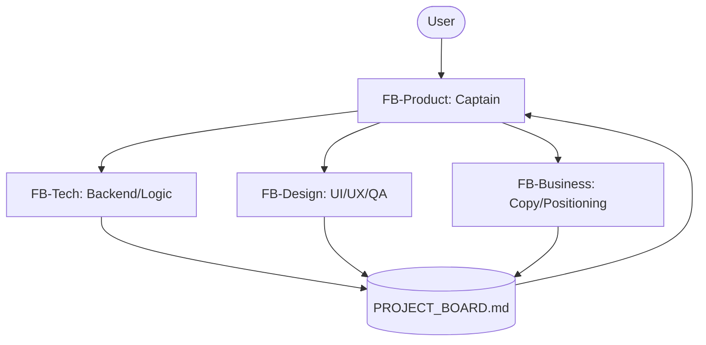

# FB-Lane Coordination Framework

A decentralized, role-isolated multi-agent coordination model designed to orchestrate agent and developer teams working concurrently. The framework prevents git merge conflicts, isolates domain concerns (engineering, design, product, business), and prevents context window overload.

## The Problem
When multiple autonomous AI agents or developers work on the same codebase, they often run into two major issues:
1. **Context Window Overload**: Loading the entire codebase, styling specifications, marketing copy, and database schemas into a single thread quickly exhausts token limits, degrading model intelligence.
2. **Git Collision & Code Bleed**: Different threads editing the same files concurrently leads to merge conflicts. For example, a design agent modifying CSS styles might conflict with a technical agent refactoring backend components in the same file.

## The Solution: The Four-Lane Model
The FB-Lane model splits work into four highly bounded, specialized lanes:

### 1. The Four Specialized Lanes
*   **`FB-Product` (Integration Captain)**: The central orchestrator. Receives instructions from the user, scopes work items, spawns/delegates to sub-threads, reviews pull requests, runs release gates, and handles staging-to-production deployments.
*   **`FB-Tech` (Backend / Logic / Data)**: Owns core application logic, database schemas, APIs, migrations, serverless functions, security rules (e.g. RLS policies), and verification suites. *Never touches UI styling or layout geometry.*
*   **`FB-Design` (UI/UX / Styling / Visual QA)**: Owns CSS, theme tokens, responsive layouts, page geometry, visual assets, and UI layout QA. Enforces strict text-containment and branding integrity. *Never touches backend logic, serverless functions, or database schemas.*
*   **`FB-Business` (Copywriting / Positioning)**: Owns application copy, onboarding text, pricing tiers, documentation, and marketing content. Operates in a **read-only** code mode, drafting text updates for `FB-Product` or `FB-Design` to integrate.

---

## The Board Loop (Task Coordination)
Instead of relying on heavy cloud PM tools, teams use a local, version-controlled markdown board: `PROJECT_BOARD.md`.

1. **Claim**: A thread claims or creates an item on the board and changes its status to `In Progress`.
2. **Execute**: The thread works in an isolated branch (`tech/[feature]` or `design/[feature]`).
3. **Audit**: When complete, the thread pushes the branch, moves the board item to `Staging QA`, and lists all modified files and QA outcomes.
4. **Merge**: `FB-Product` runs verification/release gates, performs visual/functional tests on staging, merges the branch, and moves the status to `Done`.

---

## Directory Structure
This repository provides everything you need to bootstrap this framework on your team:

*   `templates/` - Reusable configuration templates to drop into your code repos.
    *   `AGENTS.md` - Standard team boundaries and coordination rules.
    *   `PROJECT_BOARD.md` - Standard Linear-alternative task tracking file.
*   `platforms/` - Implementation guides and custom system prompts tailored to your platform of choice:
    *   `antigravity/` - Native multi-agent system prompt configurations and global skills for the **Antigravity SDK**.
    *   `claude/` - Rules and system prompts for **Claude Projects** and **Cursor**.
    *   `codex/` - CLI and git-centric rules for **Codex**.

## License
Licensed under the [MIT License](LICENSE).
