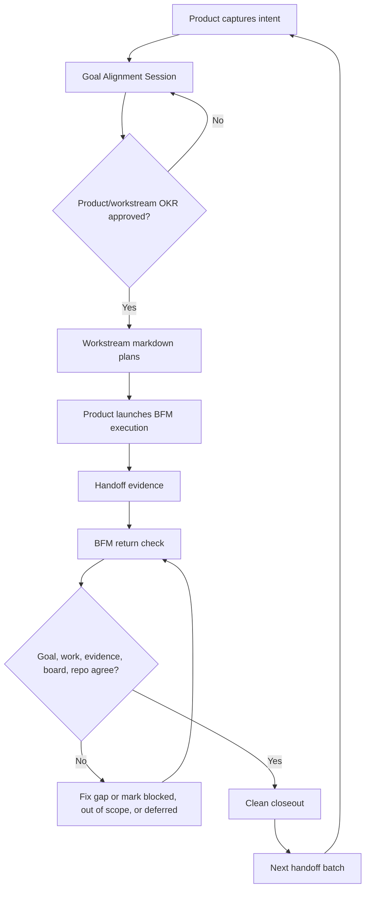

# FB-Lane: Loop Engineering for AI Work

AI agents execute fast. Product work still fails when they do not return to the
goal, the evidence, the board, and the real repo state.

FB-Lane is a lightweight implementation of **Loop Engineering**: a way for a
Product Lead to approve the goal, let specialist lanes plan, launch BFM for
execution, and force the work back through evidence before anything is called
done.

[Loop Engineering deep dive](docs/loop-engineering.md) | [FAQ](FAQ.md) |
[Setup](docs/setup.md) | [Maintenance](docs/maintenance.md) | [Changelog](CHANGELOG.md)

## The Thesis

Codex, Claude Code, and Antigravity already provide powerful agent execution.
The missing layer is usually not speed. It is alignment.

Without a loop, parallel AI work drifts:

- goals change in chat but not in the repo
- Design, Tech, and Business make different assumptions
- handoffs exist but are not reflected in source
- tests pass while the product promise remains incomplete
- Product has to reconstruct status from chat history

Loop Engineering keeps five things aligned:

1. the approved goal
2. the work that BFM executes from approved lane plans
3. the evidence they return
4. the board state Product uses to sequence
5. the repo truth in source, docs, tests, and git

FB-Lane gives that loop a small set of files and commands: `PROJECT_BOARD.md`,
`docs/handoffs/index.md`, lane plans/handoffs, file claims during BFM execution,
`doctor`, and BFM/Product closeout checks.

The operating rule is awareness, isolation, integration: `PROJECT_BOARD.md` and
`docs/handoffs/index.md` create shared awareness like a standup;
branches/worktrees isolate execution like separate desks; BFM integrates
outcomes like Product/release review. Worktrees do not replace coordination: no
private worktree should produce a huge unannounced diff, edit source without
board/lock awareness, or close while multiple outputs still need BFM
reconciliation.

FB-Lane is not CI/CD. It includes CI readiness evidence for Product/BFM
closeout: automated merge safety, manual release control.

FB-Lane evals are lightweight behavior checks for the agents themselves. They
answer: did Product/BFM run the loop correctly? Keep them as Markdown
scorecards until repeated failures justify automation.

## FB-Lane Framework OKR

This is the framework north star, not a project ritual.

**Objective:** Help Product Leads run multi-agent work without losing alignment
between goals, evidence, board state, and repo truth.

**Directional Key Results:**

- Reduce serious coordination startup context by roughly 60-70% when it is safe
  to do so, while preserving blockers, gates, and dependencies.
- Account for every non-quick BFM handoff at closeout as `implemented`,
  `already done`, `blocked`, `out of scope`, or `explicitly deferred`.
- Keep new bootstrapped projects on the simple contract:
  `PROJECT_BOARD.md` is truth, `docs/handoffs/index.md` is routing, and detailed
  handoffs are detail.

**Definition of Done:** FB-Lane docs, skills, bootstrap templates, `doctor`, and
Product/BFM closeout guidance all support the return loop without per-task OKR
generation, numeric loop scoring, a giant `doctor`, a second-board handoff
index, or quick-task ceremony.

## The Core Loop



For non-trivial work, BFM does not start by coding. It starts with a **Goal
Alignment Session**:

- Product discusses a Product/workstream `Objective`
- Product discusses measurable `Key Results`
- Product defines the `Definition of Done`
- Product names the `Gate / Review Point`
- Product/BFM proposes stable lane OKRs where lanes are relevant
- The user explicitly approves or changes it
- Product records the approved OKR in the board
- Lane mini-loops return evidence against their lane OKR and the Product/workstream OKR
- BFM executes approved markdown plans only against that stable OKR tree

After approval, BFM changes approach, scope, or sequence to fit the OKRs. It does
not dynamically create or rewrite OKRs during execution; any OKR change requires
discussion and explicit user approval.

Directional targets are not hard pass/fail numbers. Product/BFM uses a loop
health flag at closeout: `healthy`, `watch`, `needs Product review`, or
`blocked`.

## Plan-Only Workstreams

Normal workstream threads are read-only planning lanes. Product, Tech, Design,
and Business may ask questions, investigate, critique, and write markdown
plans/handoffs. They must not edit application/source code, create implementation
branches, commit, submit, merge, deploy, or change provider state from ordinary
workstream chat.

Product is source-read-only too. Product may edit coordination markdown:
`PROJECT_BOARD.md`, plans, handoffs, OKRs, Definition of Done, sequencing notes,
and closeout notes.

Source changes happen only inside a Product-launched **BFM (Build Flow
Manager)** execution run. BFM reads the approved plans, sequences work, claims
files, dispatches implementation workers, verifies evidence, and returns to the
board/docs/source/git state before closeout.

## Why Product Leads Care

FB-Lane is for the Product Lead who wants agent speed without becoming the human
traffic controller.

It makes these questions visible in the repo:

- What are we trying to achieve?
- Who owns this slice?
- Which files are safe to edit?
- What evidence proves the work met the goal?
- What is blocked, deferred, or out of scope?
- What can Product merge or release?

The point is not to add ceremony. The point is to make the return loop explicit
enough that agents cannot finish by saying "done" when the board, source, docs,
or tests say otherwise.

## How FB-Lane Implements The Loop

| Loop need | FB-Lane mechanism |
|---|---|
| Approved Product/workstream OKR | `Goal Alignment Session` block in `PROJECT_BOARD.md` |
| Stable lane OKRs | Standing Tech, Design, Business, and Product quality anchors |
| Role clarity | FB-Product, FB-Tech, FB-Design, and FB-Business lanes |
| Collision control | File claims plus named branches/worktrees for isolated execution |
| Cheap context lookup | `docs/handoffs/index.md` routes to detailed handoff files |
| Durable plan/handoff | `docs/handoffs/<task-id>.md` or project plan markdown |
| Evidence return | `Lane OKR Fit`, `Mini-loop Evidence`, and `Evidence Against Product OKR` |
| Health check | `node tools/fb-lane.cjs doctor` |
| Agent behavior evals | Optional Markdown scorecards for repeated loop failures |
| Execution gate | Product-launched BFM run |
| Integration | BFM/Product reconciliation before sequencing or merge |
| Closeout | Explicit status plus loop health flag: `healthy`, `watch`, `needs Product review`, or `blocked` |

## Roles Inside The Loop

| Lane | Owns | Boundary |
|---|---|---|
| FB-Product / BFM | Goal approval, sequencing, tradeoffs, integration, staging/live decisions. | Product is source-read-only; source changes start only through a Product-launched BFM run. |
| FB-Tech | Technical investigation, risks, implementation plans, tests to run. | Plan-only in normal workstream chat; source edits only as a BFM execution worker. |
| FB-Design | UI critique, layout plans, visual QA plans, asset guidance. | Plan-only in normal workstream chat; source edits only as a BFM execution worker. |
| FB-Business | Positioning, onboarding copy, pricing, marketing text, docs. | Read-only on application/source code; records integration targets for BFM. |

## When To Use It

Default to normal/simple coding when the request is one-thread and has no listed
coordination trigger. Skip FB-Lane for:

- read-only questions
- code explanations
- tiny fixes
- isolated edits
- independent experiments where native worktrees are enough

Use **FB-Lane light** when the objective mentions handoffs, board items, lanes,
BFM, Product, Design, Business, coordination files such as `PROJECT_BOARD.md` or
`docs/handoffs/`, board-locked files, multiple threads/agents/workstreams, or
durable context that must survive chat loss. Keep it lightweight: read the
board/locks, claim or note only the exact files needed, and avoid ceremony unless
another lane or Product must continue it.

Escalate to **Product/BFM** when the work requires deciding what to build,
sequence, defer, approve, merge, release, stage, or launch; crosses pricing,
payments, trials, subscriptions, promo codes, auth, privacy, analytics, secrets,
deploy, staging, or live gates; touches camera/capture/save/export or another
core product flow; or needs multiple lane outputs reconciled before source
changes.

## Start Here

Choose the platform guide for your tool:

| Platform | Maturity | Guide | Best for |
|---|---|---|---|
| Antigravity 2.0 | Alpha | [platforms/antigravity/README.md](platforms/antigravity/README.md) | Native multi-agent orchestration and isolated worker lanes. |
| Claude Code | Alpha | [platforms/claude-code/README.md](platforms/claude-code/README.md) | `@agent` / `/agents` lane workflows with MCP and optional worktrees. |
| Codex | Public beta | [platforms/codex/README.md](platforms/codex/README.md) | Codex plugin, skills, MCP, subagents, and worktrees. |

Fallback bootstrap options live in [docs/setup.md](docs/setup.md). The operating
model lives in [docs/loop-engineering.md](docs/loop-engineering.md).

## CLI Quick Reference

Run from a project root that has been bootstrapped with FB-Lane:

| Command | Purpose |
|---|---|
| `node tools/fb-lane.cjs status` | Show tasks, owners, and file claims. |
| `node tools/fb-lane.cjs doctor` | Read-only loop health check for board, rules, handoff index, locks, handoffs, and OKR approval. |
| `node tools/fb-lane.cjs claim <id> <lane> [locks] [--worktree]` | BFM execution worker claims work and locks files. |
| `node tools/fb-lane.cjs quick <lane> <locks> [desc]` | Create a tiny BFM execution task; skips OKR approval, not the source-change boundary. |
| `node tools/fb-lane.cjs submit <id> [staging_url]` | Submit work for Product/Captain review. |
| `node tools/fb-lane.cjs merge <id>` | Product/Captain merge path after review. |
| `node tools/fb-lane.cjs bootstrap` | Manual setup path. See [docs/setup.md](docs/setup.md). |

The board/index/handoff split is deliberate: `PROJECT_BOARD.md` is truth for
status, sequencing, gates, ownership, and locks; `docs/handoffs/index.md` is
routing; detailed handoffs are detail. The index should stay compact with
`Task / Topic`, `Lane`, `Status`, `Depends / Blocks / Gate`,
`Checks / Evidence`, and `Detail`. Keep full OKRs, QA checklists, plans, logs,
rationale, copy variants, and implementation detail in detailed handoffs.

Before source execution, read board/status/locks and the relevant handoff index.
During isolated work, name the task, branch/worktree, lane, and locked files in
the handoff or board update. At closeout, report whether the branch/worktree is
clean, merged, stale, blocked, or intentionally left open.

## Codex Plugin Upgrade

For an existing Codex install, refresh from the FB-Lane marketplace:

```bash
codex plugin add fb-lane-coordination@fb-lane
```

Start a new Codex thread after reinstalling so newly loaded skills and MCP tools
pick up the refreshed plugin context. Codex may keep older cache folders on disk;
the active version is the one shown by:

```bash
codex plugin list | rg "fb-lane-coordination"
```

## More

- [Loop Engineering deep dive](docs/loop-engineering.md)
- [Setup alternatives](docs/setup.md)
- [FAQ](FAQ.md)
- [Plugin package](plugins/fb-lane-coordination/README.md)
- [Example app](examples/my-app/README.md)
- [License](LICENSE)
