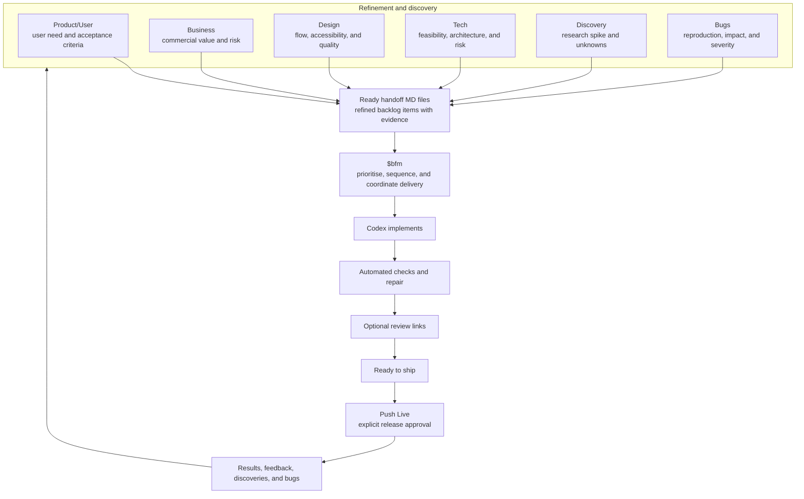

# FB for Agile Teams

[Overview](../README.md) · [Agile Teams](fb-for-agile-teams.md) · [Why FB](why-fb.md) · [Full Loop](fb/full-loop.md)

For the short version, see [FB's six-workstream overview](../README.md#one-big-loop-six-mini-loops).

FB is a Codex plugin that gives AI-assisted product delivery familiar agile
shapes: refinement, discovery, defect triage, prioritisation, implementation,
automated checking, review, release, and learning.

It does not replace Scrum, Kanban, or human product judgement. These are useful
human-team equivalents, not mandatory ceremonies. The user remains the product
authority for changed priorities, product direction, sensitive decisions, and
release approval.

## The short version

In a human agile team, people discuss work, refine it, decide what is ready,
prioritise it, build it, check it, review it, release it, and learn from the
result. FB creates the same continuous delivery loop with six focused
workstreams and Codex.

Open the [Full Loop](fb/full-loop.md) for the complete operating view.

## FB and familiar agile-team work

See the [Why FB comparison](why-fb.md#comparison) for how this delivery
layer differs from ordinary Codex, worktrees, Capacitor, and BMAD.

| In FB | Closest human-team equivalent | What it produces |
|---|---|---|
| Product/User conversation | Product discovery and Product Backlog Refinement (often called backlog grooming) with a Product Owner | User need, decisions, assumptions, acceptance criteria, and priorities |
| Design conversation | Design critique and design-backlog refinement | User flow, interaction, accessibility, visual-quality recommendation, and review evidence |
| Business conversation | Commercial or strategy review | Positioning, pricing, distribution, acquisition, retention, and commercial risks |
| Tech conversation | Technical discovery, architecture review, or engineering refinement | Feasibility, architecture, security, performance, integration, and delivery risks |
| Discovery conversation | Research spike | Evidence that reduces an important unknown before the team commits direction |
| Bugs conversation | Defect triage | Reproduction, affected users, severity, and regression/verification requirement |
| Ready handoff MD | Refined backlog item with supporting evidence | Work that is ready for prioritisation; it is not automatic implementation authority |
| `$bfm` | Sprint Planning plus Kanban replenishment and delivery coordination | A dependency-aware sequence of approved work for Codex to implement |
| Codex implementation | Delivery team building selected work | Source changes and implementation evidence |
| Automated checks and repair | CI plus engineers owning failed-test recovery | Evidence that the candidate works, or a specific recovery action |
| Optional review links | Demo, staging review, or QA session | A convenient way to inspect the result; routine QA remains FB-owned |
| Ready to ship | Release candidate that passed required checks | A clear release-readiness state |
| Push Live | Explicit release or change approval | Merge and deployment authority |
| Results and feedback | Review, retrospective, and backlog feedback | New questions, discoveries, improvements, and bugs for the next loop |

## What happens in a real example

The [Why FB examples](why-fb.md#concrete-examples) show more delivery and
recovery situations.

Imagine a user says: **“Our onboarding feels confusing.”**

1. Product/User captures the user problem, the desired outcome, and what would
   count as success.
2. Design explores the onboarding flow and identifies experience or
   accessibility improvements.
3. Discovery checks whether there is enough real evidence about where users get
   stuck. If not, it recommends a small research step rather than inventing a
   conclusion.
4. Tech identifies the implementation constraints and risks.
5. Bugs records any broken behaviour with steps to reproduce and severity.
6. Each useful conversation creates a handoff MD. Workstreams with no useful
   contribution record **None relevant** rather than manufacturing work.
7. When the user says `$bfm`, FB reconciles the ready handoffs, spots
   duplication or conflict, prioritises the smallest approved sequence, and
   directs Codex implementation.
8. FB runs automated checks and owns bounded repair. If there is something
   useful to inspect, it provides optional review links.
9. When the result is **Ready to ship**, only **Push Live** authorises merge and
   deployment.
10. The released result, user feedback, new discoveries, and bugs return to the
    relevant workstreams for the next mini-loop.

## How `$bfm` relates to Scrum and Kanban

`$bfm` is not a replacement Scrum Master, Product Owner, or engineering lead.
It is the integration point where FB turns approved, evidence-backed work into
an executable delivery sequence.

For a Scrum-oriented team, it is closest to the part of refinement and Sprint
Planning where the team checks readiness, dependencies, risk, and ordering.
For a Kanban-oriented team, it is closest to replenishment and pulling ready
work into delivery. In both cases, the user still owns material product
decisions and final release approval.

The detailed execution contract is in the [workflow](fb/workflow.md).

## What FB deliberately does not do

The [guardrails](fb/guardrails.md) define the approval, Git, recovery, and
release boundaries behind these limits.

- It does not require all six workstreams for every change.
- It does not turn every conversation into implementation work.
- It does not invent user research, approve disputed priorities, or silently
  change scope.
- It does not ask the user to substitute for routine automated testing.
- It does not release on its own. **Push Live** remains the explicit boundary.

## When FB is most useful

FB is useful when product conversations, design recommendations, technical
constraints, research findings, and bug reports would otherwise be scattered
across chats. It gives the team one durable path from discussion to evidence,
approved work, implementation, verification, release, and learning.

For a clear, isolated task, normal Codex may be enough. FB adds value when the
team needs to coordinate several kinds of product work without asking a person
to manually combine every agent’s output.
