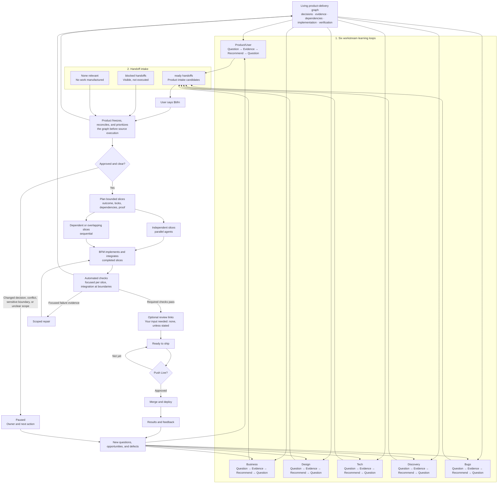

# Full FB Graph Diagram

[Overview](../../README.md) · [Agile Teams](https://github.com/friedbeef1/fb-lane-coordination/blob/main/docs/fb-for-agile-teams.md) · [Why FB](../why-fb.md) · [Full Loop](full-loop.md)

This is the complete operating view of FB's **Graph Engineering** system. The graph
is the map connecting decisions, evidence, dependencies, implementation,
verification, and release state. Workstream loops show how work learns and
moves inside that map; `$bfm` navigates and executes it, while **Push Live**
authorizes release. This is not a graph database, knowledge graph, or GraphQL
architecture.
The [workflow](workflow.md) defines the detailed execution and return-loop
contract.

- A `ready` handoff is ready for Product intake, not approval or execution
  authority. `blocked` work remains visible, while **None relevant** prevents a
  workstream from inventing work.
- `$bfm` freezes intake. Product must disposition every candidate as **Include
  now**, **Blocked**, **Deferred**, **Duplicate**, **Rejected**, or
  **Superseded** before source execution. Product then reconciles duplicates,
  conflicts, and dependencies, prioritizes and sequences only **Include now**
  candidates, and records the Product plan plus Build Brief before BFM
  execution. It plans the smallest useful dependency graph up front:
  independent, non-overlapping slices may use parallel agents; dependent,
  shared-file, or unresolved work remains sequential. Internal routing remains
  private.
- A substantial outcome may run for hours across bounded slices. FB uses focused
  proof per slice, integration checks at meaningful combinations, and broad
  validation only at a release checkpoint. Unexpected complexity resplits the
  remaining work without discarding completed slices.
- FB owns scoped repair within each slice's loop budget.
  Optional review links provide visibility without returning routine QA to the
  user.
- **Ready to ship** means the required checks passed. Only **Push Live**
  authorizes merge and deployment.
