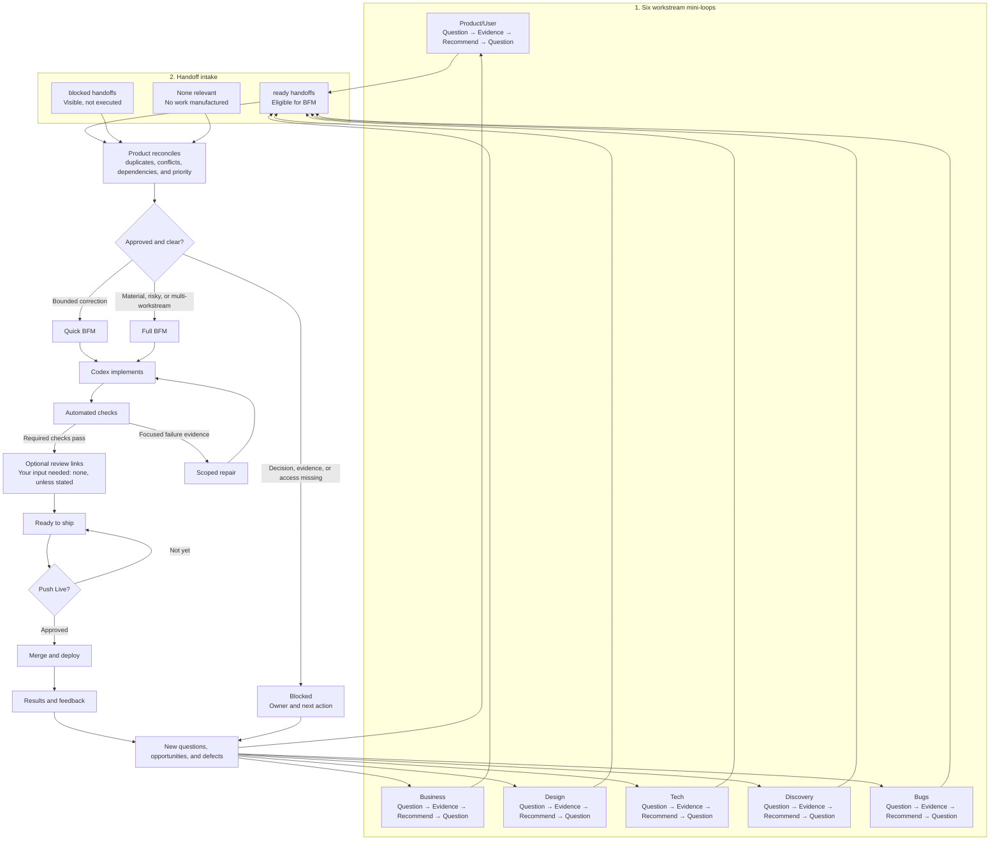

# Full FB Loop Diagram

This is the complete operating view of FB. The root README keeps a simpler
picture; this page shows how evidence becomes approved work, how BFM chooses an
execution path, and how delivery results restart the six workstream loops.

- Only valid `ready` handoffs enter execution. `blocked` work remains visible,
  while **None relevant** prevents a workstream from inventing work.
- Product reconciles the evidence and chooses the sequence. Quick BFM handles
  approved bounded corrections; Full BFM handles material or risky work.
- FB runs automated checks and owns scoped repair within its loop budget.
  Optional review links provide visibility without returning routine QA to the
  user.
- **Ready to ship** means the required checks passed. Only **Push Live**
  authorizes merge and deployment.
