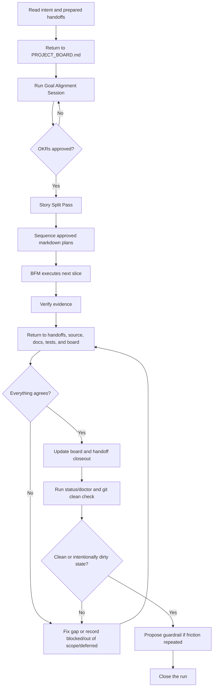

# Loop Engineering

Loop Engineering is the FB-Lane operating model. It is the discipline of making
agent work return to the approved goal, the evidence, the board, and the repo
before Product calls the work complete.

It is not a new app lifecycle. It is a small control loop for AI execution.

Current model name: **FB-Lane 0.2.0-beta: Loop Engineering public beta**. The
Codex plugin manifest may still show a build ID such as
`0.1.2+codex.20260627210000` until the release is cut. For the v1-to-latest
before/after, see [FB-Lane Versions](versioning.md).

## Why The Loop Exists

AI agents are strong at local execution. They are weaker at preserving product
intent across long-running, multi-thread work unless the repo gives them durable
state to return to.

The loop exists to prevent these failures:

- a lane implements something adjacent to the goal, not the goal
- a handoff is written but never wired into source
- tests pass while copy, visual QA, or release gates are still pending
- Product marks work complete without reconciling every handoff
- normal workstream chat turns into unsequenced source edits
- chat context disappears and the next thread repeats or contradicts the work

The core rule:

```text
No closeout until goal, work, evidence, board state, and repo truth agree,
or every disagreement is explicitly marked blocked, out of scope, or deferred.
```

Before prioritizing a BFM run, Product/BFM also performs a Story Split Pass. If
the batch mixes lanes, locks, risks, gates, review surfaces, blocked work, and
ready work, split it into smaller stories and sequence only the unblocked slice.
If no split helps, say `No split needed` and continue.

The practical rule is awareness, isolation, integration:

- `PROJECT_BOARD.md` and `docs/handoffs/index.md` create shared awareness like a
  standup.
- Branches/worktrees isolate execution like separate desks.
- BFM integrates outcomes like Product/release review.

Worktrees do not replace coordination. A lane should not disappear into a
private worktree, produce a huge unannounced diff, edit source without
board/lock awareness, or close without BFM reconciliation when multiple outputs
exist.

## FB-Lane Framework OKR

This OKR governs FB-Lane itself. It is not copied into every project as
ceremony.

**Objective:** Help Product Leads run multi-agent work without losing alignment
between goals, evidence, board state, and repo truth.

**Directional Key Results:**

- Reduce serious coordination startup context by roughly 60-70% when safe,
  while preserving blockers, gates, and dependencies.
- Account for every non-quick BFM handoff at closeout as `implemented`,
  `already done`, `blocked`, `out of scope`, or `explicitly deferred`.
- Keep bootstrapped projects on the simple contract: board is truth, handoff
  index is routing, workstream cards are summaries, and detailed handoffs are
  detail.
- Catch repeated loop friction and propose one small guardrail for Product
  approval before the same failure causes more rework.

**Definition of Done:** Docs, skills, templates, `doctor`, and Product/BFM
closeout guidance support the return loop without per-task OKR generation,
numeric loop scoring, a giant `doctor`, a second-board handoff index, or
quick-task ceremony.

## The Operating Loop



## Proactive Loop Hardening

Product/BFM should proactively propose loop hardening when it sees repeated
workflow failure, coordination friction, stale state, missing evidence, or
preventable rework. Propose one small guardrail at a time with:

- observed pattern
- recommended guardrail
- cost
- benefit
- files/rules affected
- approval needed

Do not silently change the process. Skip one-off or low-impact issues.

At closeout, Product/BFM records this compact learning check:

```md
Loop Learning:
- Feedback captured: <none | issue found>
- Repeated pattern?: no | yes
- Tooling needed?: none | propose guardrail | propose automation | propose eval
- Product approval needed?: no | yes
```

Heavier tooling starts only from this field. Use `none` for one-off friction,
`propose guardrail` for repeated process misses, `propose automation` for
repeated manual checks, and `propose eval` for repeated agent-behavior failures.

## Approval Autonomy Phases

Use phases so loops earn trust without silently promoting themselves:

- **Phase 1: Shadow Approval** - Product/BFM still asks the user, but records
  `Would self-approve: yes/no` and the reason.
- **Phase 2: Bounded Self-Approval** - Product/BFM may self-approve low-risk
  continuation work that fits the approved OKR and Definition of Done.
- **Phase 3: Exception-Only Approval** - Product/BFM proceeds inside approved
  boundaries and asks only for exceptions.

Transitions are recommendations, not automatic promotion:

- Move from Phase 1 to Phase 2 after one day or three BFM runs where shadow
  approval matched the user's decision with no material miss.
- Move from Phase 2 to Phase 3 after five self-approved low-risk decisions with
  no rollback, stale dirty state, or hidden gate.
- Move back down on any material miss, failed evidence, accidental source edit,
  stale uncommitted work, scope drift, or hidden gate.

Bounded self-approval is only for low-risk continuation work. It must fit an
approved Product/workstream OKR and Definition of Done, add no new scope or OKR,
have passing or explicitly non-blocking checks, and have no lock conflict or
unresolved dirty state. Never self-approve live deploys, secrets, payment
credentials, auth/privacy changes, destructive data actions, provider-state
changes, unclear goals, failed evidence, or product direction changes.

Workstream loops may recommend `safe to auto-accept`; Product/BFM owns the
actual self-approval decision.

## Goal Alignment Session

For non-trivial BFM runs, Product/BFM starts with a Goal Alignment Session before
sequencing execution. The session is not a request for the Product Manager to
write OKRs from scratch. BFM proposes plain-language OKRs for approval or
discussion.

The approved OKR tree lives on `PROJECT_BOARD.md`:

```md
## Goal Alignment Session

Product / Workstream OKR:
Objective: <the outcome Product wants>
Key Results:
- <measurable result>
- <measurable result>
Definition of Done: <what must be true before closeout>
Gate / Review Point: <where the user or Product reviews>
Approval: pending | approved
Justification: <why this OKR fits the request and repo truth>

Lane OKRs:
- Product: <how sequencing, tradeoffs, or release gates support the Product/workstream OKR>
- Tech: <how implementation, reliability, or tests support the Product/workstream OKR>
- Design: <how UI, usability, or visual QA support the Product/workstream OKR>
- Business: <how copy, positioning, or go-to-market support the Product/workstream OKR>
```

Rules:

- `TASK-Q-*` quick tasks are exempt from the approval gate.
- Product/workstream OKRs are the top-level outcome.
- Lane OKRs are stable lane-specific contributions to that outcome.
- Reuse or clarify the approved workstream/BFM-target OKR. Do not generate a
  fresh OKR for every task.
- Mini-loops produce evidence against lane OKRs; they do not create new OKRs.
- BFM stops before execution when approval is missing, OKRs are unclear, or a
  handoff conflicts with the approved OKR tree.
- After approval, BFM may change approach, scope, or sequence to fit the OKRs.
- BFM does not dynamically create, add, edit, or replace approved OKRs during execution.
- If a new or changed OKR seems necessary, Product/BFM explains why in plain
  language and stops for explicit approval before applying it.

## Progressive Disclosure Files

FB-Lane uses four layers so agents can restart without reading everything:

| Layer | File | Purpose |
|---|---|---|
| Truth | `PROJECT_BOARD.md` | Status, owners, locks, approved OKRs, sequencing, gates |
| Routing | `docs/handoffs/index.md` | Compact lookup for active dependencies, blockers, gates, checks, and detail files |
| Revisit summary | `docs/workstreams/<lane>.md` | What Product/BFM already executed or deferred for a lane, what remains pending or blocked, and evidence links |
| Detail | `docs/handoffs/<task-id>.md` | Plans, rationale, logs, QA detail, copy variants, implementation notes |

Product/BFM refreshes the relevant workstream card after executing or explicitly
deferring a lane handoff. Worker lanes read `PROJECT_BOARD.md`, then
`docs/handoffs/index.md`, then their card before opening detailed handoffs. The
card must stay compact and must not duplicate the board, full OKRs, QA logs,
plans, rationale, copy variants, or implementation details.

## Plan-Only Workstreams

Product, Tech, Design, and Business workstream threads are read-only planning
lanes by default. They may ask questions, investigate, critique, and write
markdown plans or handoffs. They must not edit application/source code, create
implementation branches, commit, submit, merge, deploy, or change provider state
from ordinary workstream chat.

Product may edit coordination markdown: `PROJECT_BOARD.md`, plans, handoffs,
OKRs, Definition of Done, sequencing notes, and closeout notes. Product must not
edit application/source code directly.

If the user says `PLEASE IMPLEMENT THIS PLAN` outside Product/BFM, the lane must
confirm whether to prepare the Product/BFM handoff or execute there as an
explicit one-off exception before editing source.

Execution begins only when Product launches **BFM (Build Flow Manager)**. During
that run, BFM reads the approved plans, sequences work, claims files, dispatches
implementation workers, verifies evidence, and returns to board/docs/source/git
state before closeout.

## Mode Selection

Default to normal/simple coding when the request is one-thread and has no listed
coordination trigger. Do not create board noise for read-only questions,
code explanations, tiny fixes, isolated edits, or independent experiments where
native worktrees are enough.

Use FB-Lane light when the objective mentions handoffs, board items, lanes, BFM,
Product, Design, Business, coordination files such as `PROJECT_BOARD.md` or
`docs/handoffs/`, board-locked files, multiple threads/agents/workstreams, or
durable context that must survive chat loss. Read the board/locks, keep the
scope narrow, and skip Goal Alignment or handoff ceremony unless another lane or
Product must continue the work.

Escalate to Product/BFM when the work requires deciding what to build, sequence,
defer, approve, merge, release, stage, or launch; crosses
pricing/payments/trials/subscriptions/promo codes, auth/privacy/analytics/secrets,
deploy/staging/live gates; touches camera/capture/save/export or another core
product flow; or needs multiple lane outputs reconciled before source changes.

Good objective:

```md
Objective: Let a signed-in user reach the camera preview, capture one mirrored
photo, and save it locally without a full-page reload.
```

Bad objective:

```md
Objective: Finish the feature.
```

## Definition Of Done

`Definition of Done` is the closeout contract. It answers, "What must be true
before this run can stop?"

It is broader than a test plan. It can include:

- source behavior
- copy integration
- visual QA evidence
- docs or handoff updates
- staging review
- clean git state
- named blockers or deferrals

Definition of Done does not automatically mean TDD. Use TDD when the work has a
clear behavior contract, a regression risk, or logic that benefits from a
red-green-refactor loop. For docs, copy, sequencing, or visual work, the
Definition of Done may be better proven by link checks, screenshot evidence,
wording scans, or Product approval.

## Lane Handoffs And Lane OKR Fit

Lanes do not own the Product/workstream OKR. Product/BFM owns it. Lanes own
evidence against their lane OKR and the Product/workstream OKR.

Mini-loops are the small evidence cycles inside a lane:

```text
lane OKR -> plan/task slice -> verify assumptions -> return evidence -> update handoff
```

They should make progress clearer, not add more goals.

For non-trivial handoffs, use this compact form:

```md
## Goal Alignment Session

Lane OKR Fit: aligned | suggest approach change | blocked by OKR ambiguity
Mini-loop Evidence: <lane evidence from its smallest real verification loop>
Evidence Against Product OKR: <evidence that weakens or blocks the approved Product/workstream OKR> | None identified
```

What each value means:

- `aligned`: the lane plan fits the approved lane OKR.
- `suggest approach change`: the OKR tree is valid, but the lane recommends a
  different path to satisfy it.
- `blocked by OKR ambiguity`: the lane cannot safely proceed until Product or
  the user clarifies the goal.

## BFM Return Loop

When the user says "run BFM" or "process all lane handoffs", BFM/Product reads
the prepared handoffs for the target, returns to the board, reconciles them
against repo truth, and then sequences execution.

Use progressive disclosure:

1. Read `PROJECT_BOARD.md` for current task state, ownership, sequencing, and locks.
2. Read `docs/handoffs/index.md` to find the target handoffs.
3. Open only the detailed handoffs relevant to the target, unless Product/BFM is doing a full closeout audit.
4. Before non-quick sequencing, create or refresh `docs/handoffs/index.md` when handoffs exist and the lookup layer is missing, stale, or too vague.
5. Keep the index compact with `Task / Topic`, `Lane`, `Status`, `Depends / Blocks / Gate`, `Checks / Evidence`, and `Detail`. Keep full OKRs, QA checklists, plans, logs, rationale, copy variants, and implementation detail in the detailed handoffs.
6. Before source execution, confirm board/status/locks and the relevant index;
   during isolated work, name the task, branch/worktree, lane, and locked files.

The index is not a second board. It is a compact routing layer so agents do not
burn context reading every historical handoff.

BFM must not close until every discovered handoff has one explicit status:

- `implemented`
- `already done`
- `blocked`
- `out of scope`
- `explicitly deferred`

That status must match:

- `PROJECT_BOARD.md`
- source files
- docs
- tests/checks
- handoff evidence
- git state

If they disagree, BFM either fixes the gap or records the disagreement as
blocked, out of scope, or explicitly deferred.

## Doctor

`doctor` is a read-only loop health check:

```bash
node tools/fb-lane.cjs doctor
```

It checks whether the project has the coordination files and whether active
non-quick work has the expected loop state. It can warn about issues such as:

- missing board or rules files
- missing handoff directory
- missing `docs/handoffs/index.md` when non-quick handoffs exist
- old-style `docs/handoffs/index.md` files that lack the dependency/gate or evidence columns
- active locks with unclear state
- non-quick handoffs missing `Lane OKR Fit`, `Mini-loop Evidence`, or `Evidence Against Product OKR`
- non-quick BFM targets with missing or unapproved Goal Alignment Session OKRs
- handoffs that imply a new or changed OKR without a board-approved OKR update
- intentionally dirty git state that Product should name before closeout

In the current public beta, `doctor` is advisory. It warns so Product can
correct drift without turning every mismatch into a hard block.

## Loop Health Flags

Directional targets do not need exact numeric pass/fail scoring. Product/BFM
adds one closeout health flag:

- `healthy`: the loop met the target or missed it without added safety risk.
- `watch`: the loop was safe, but Product should notice a trend or small miss.
- `needs Product review`: the miss may affect sequencing, scope, or closeout.
- `blocked`: the run cannot proceed safely.

Stop only when drift can cause wrong work: unclear OKRs, stale board/index,
missing handoff status, missing evidence, or source/docs/tests disagree.

## CI Readiness

FB-Lane is not CI/CD. Its CI readiness loop gives Product/BFM closeout evidence:
local validation plus the GitHub Actions readiness signal. CI can be required
before merge while staging, live deploy, plugin release, and publish decisions
remain manual.

## Evals

Evals check whether the agent followed the loop. They are different from tests:

- tests check product/code behavior
- `doctor` checks repo coordination health
- CI checks merge readiness
- evals check agent behavior and judgment

Use evals when the same agent failure repeats, such as:

- BFM closes without accounting for every handoff
- Product changes scope without updating the approved OKR
- lanes edit source outside BFM execution
- closeout says "done" without evidence

Start with a Markdown scorecard, not a framework. The generic template lives at
`docs/evals/agent-behavior-scorecard-template.md` and covers:

- non-Product execution gate
- BFM closeout accounting
- evidence honesty
- goal and scope fit

Automate only after the scorecard proves useful.

## Closeout Standard

A good closeout names:

- handoffs accounted for
- implemented work
- already-done work
- blocked or deferred work
- evidence and checks run
- board updates
- remaining gates
- branch/worktree state: clean, merged, stale, blocked, or intentionally dirty
- external-service cleanup: test mode, created records/resources, cleanup evidence, or pending gate

Passive closeout note shape:

```text
Closeout note - TASK-123: implemented.
Health: <healthy|watch|needs Product review|blocked>.
Loop Learning: Feedback captured: <none|issue found>; Repeated pattern?: <no|yes>; Tooling needed?: <none|propose guardrail|propose automation|propose eval>; Product approval needed?: <no|yes>.
Delivered: <work completed>.
Evidence: <checks, screenshots, docs, PRs, staging links>.
Remaining: <merge, approval, deploy, or none>.
Handoff: docs/handoffs/TASK-123.md.
```

The closeout note is informational. It should not contain commands, trigger
phrases, or instructions that start another lane by accident.

## Platform Setup

Loop Engineering is the operating model. Platform setup is tactical:

- [Antigravity](../platforms/antigravity/README.md) - Alpha
- [Claude Code](../platforms/claude-code/README.md) - Alpha
- [Codex](../platforms/codex/README.md) - Public beta
- [Setup alternatives](setup.md)
