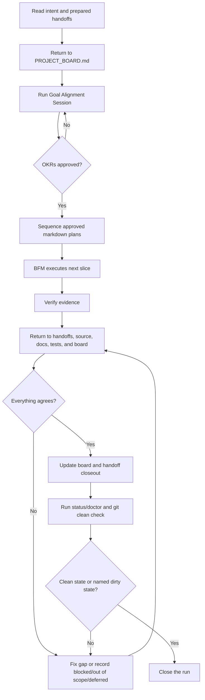

# Loop Engineering

Loop Engineering is the FB-Lane operating model. It is the discipline of making
agent work return to the approved goal, the evidence, the board, and the repo
before Product calls the work complete.

It is not a new app lifecycle. It is a small control loop for AI execution.

## Why The Loop Exists

AI agents are strong at local execution. They are weaker at preserving product
intent across long-running, multi-thread work unless the repo gives them durable
state to return to.

The loop exists to prevent these failures:

- a lane implements something adjacent to the goal, not the goal
- a handoff is written but never wired into source
- tests pass while copy, visual QA, or release gates are still pending
- Product marks work complete without reconciling every handoff
- normal workstream chat turns into unsequenced source edits
- chat context disappears and the next thread repeats or contradicts the work

The core rule:

```text
No closeout until goal, work, evidence, board state, and repo truth agree,
or every disagreement is explicitly marked blocked, out of scope, or deferred.
```

## The Operating Loop



## Goal Alignment Session

For non-trivial BFM runs, Product/BFM starts with a Goal Alignment Session before
sequencing execution. The session is not a request for the Product Manager to
write OKRs from scratch. BFM proposes plain-language OKRs for approval or
discussion.

The approved OKR tree lives on `PROJECT_BOARD.md`:

```md
## Goal Alignment Session

Product / Workstream OKR:
Objective: <the outcome Product wants>
Key Results:
- <measurable result>
- <measurable result>
Definition of Done: <what must be true before closeout>
Gate / Review Point: <where the user or Product reviews>
Approval: pending | approved
Justification: <why this OKR fits the request and repo truth>

Lane OKRs:
- Product: <how sequencing, tradeoffs, or release gates support the Product/workstream OKR>
- Tech: <how implementation, reliability, or tests support the Product/workstream OKR>
- Design: <how UI, usability, or visual QA support the Product/workstream OKR>
- Business: <how copy, positioning, or go-to-market support the Product/workstream OKR>
```

Rules:

- `TASK-Q-*` quick tasks are exempt from the approval gate.
- Product/workstream OKRs are the top-level outcome.
- Lane OKRs are stable lane-specific contributions to that outcome.
- Mini-loops produce evidence against lane OKRs; they do not create new OKRs.
- BFM stops before execution when approval is missing, OKRs are unclear, or a
  handoff conflicts with the approved OKR tree.
- After approval, BFM may change approach, scope, or sequence to fit the OKRs.
- BFM does not dynamically create, add, edit, or replace approved OKRs during execution.
- If a new or changed OKR seems necessary, Product/BFM explains why in plain
  language and stops for explicit approval before applying it.

## Plan-Only Workstreams

Product, Tech, Design, and Business workstream threads are read-only planning
lanes by default. They may ask questions, investigate, critique, and write
markdown plans or handoffs. They must not edit application/source code, create
implementation branches, commit, submit, merge, deploy, or change provider state
from ordinary workstream chat.

Product may edit coordination markdown: `PROJECT_BOARD.md`, plans, handoffs,
OKRs, Definition of Done, sequencing notes, and closeout notes. Product must not
edit application/source code directly.

Execution begins only when Product launches **BFM (Build Flow Manager)**. During
that run, BFM reads the approved plans, sequences work, claims files, dispatches
implementation workers, verifies evidence, and returns to board/docs/source/git
state before closeout.

Good objective:

```md
Objective: Let a signed-in user reach the camera preview, capture one mirrored
photo, and save it locally without a full-page reload.
```

Bad objective:

```md
Objective: Finish the feature.
```

## Definition Of Done

`Definition of Done` is the closeout contract. It answers, "What must be true
before this run can stop?"

It is broader than a test plan. It can include:

- source behavior
- copy integration
- visual QA evidence
- docs or handoff updates
- staging review
- clean git state
- named blockers or deferrals

Definition of Done does not automatically mean TDD. Use TDD when the work has a
clear behavior contract, a regression risk, or logic that benefits from a
red-green-refactor loop. For docs, copy, sequencing, or visual work, the
Definition of Done may be better proven by link checks, screenshot evidence,
wording scans, or Product approval.

## Lane Handoffs And Lane OKR Fit

Lanes do not own the Product/workstream OKR. Product/BFM owns it. Lanes own
evidence against their lane OKR and the Product/workstream OKR.

Mini-loops are the small evidence cycles inside a lane:

```text
lane OKR -> plan/task slice -> verify assumptions -> return evidence -> update handoff
```

They should make progress clearer, not add more goals.

For non-trivial handoffs, use this compact form:

```md
## Goal Alignment Session

Lane OKR Fit: aligned | suggest approach change | blocked by OKR ambiguity
Mini-loop Evidence: <lane evidence from its smallest real verification loop>
Evidence Against Product OKR: <evidence that weakens or blocks the approved Product/workstream OKR> | None identified
```

What each value means:

- `aligned`: the lane plan fits the approved lane OKR.
- `suggest approach change`: the OKR tree is valid, but the lane recommends a
  different path to satisfy it.
- `blocked by OKR ambiguity`: the lane cannot safely proceed until Product or
  the user clarifies the goal.

## BFM Return Loop

When the user says "run BFM" or "process all lane handoffs", BFM/Product reads
the prepared handoffs for the target, returns to the board, reconciles them
against repo truth, and then sequences execution.

Use progressive disclosure:

1. Read `PROJECT_BOARD.md` for current task state, ownership, sequencing, and locks.
2. Read `docs/handoffs/index.md` to find the target handoffs.
3. Open only the detailed handoffs relevant to the target, unless Product/BFM is doing a full closeout audit.

The index is not a second board. It is a cheap lookup table so agents do not
burn context reading every historical handoff.

BFM must not close until every discovered handoff has one explicit status:

- `implemented`
- `already done`
- `blocked`
- `out of scope`
- `explicitly deferred`

That status must match:

- `PROJECT_BOARD.md`
- source files
- docs
- tests/checks
- handoff evidence
- git state

If they disagree, BFM either fixes the gap or records the disagreement as
blocked, out of scope, or explicitly deferred.

## Doctor

`doctor` is a read-only loop health check:

```bash
node tools/fb-lane.cjs doctor
```

It checks whether the project has the coordination files and whether active
non-quick work has the expected loop state. It can warn about issues such as:

- missing board or rules files
- missing handoff directory
- missing `docs/handoffs/index.md` once the project has enough handoffs to need one
- active locks with unclear state
- non-quick handoffs missing `Lane OKR Fit`, `Mini-loop Evidence`, or `Evidence Against Product OKR`
- non-quick BFM targets with missing or unapproved Goal Alignment Session OKRs
- handoffs that imply a new or changed OKR without a board-approved OKR update
- dirty git state that Product should name before closeout

In v1, `doctor` is advisory. It warns so Product can correct drift without
turning every mismatch into a hard block.

## CI Readiness

FB-Lane is not CI/CD. Its CI readiness loop gives Product/BFM closeout evidence:
local validation plus the GitHub Actions readiness signal. CI can be required
before merge while staging, live deploy, plugin release, and publish decisions
remain manual.

## Evals

Evals check whether the agent followed the loop. They are different from tests:

- tests check product/code behavior
- `doctor` checks repo coordination health
- CI checks merge readiness
- evals check agent behavior and judgment

Use evals when the same agent failure repeats, such as:

- BFM closes without accounting for every handoff
- Product changes scope without updating the approved OKR
- lanes edit source outside BFM execution
- closeout says "done" without evidence

Start with a Markdown scorecard, not a framework:

```md
# BFM Closeout Eval

- [ ] Approved OKR exists before execution.
- [ ] Every handoff is implemented, already done, blocked, out of scope, or deferred.
- [ ] Evidence matches board, source, docs, tests, and git state.
- [ ] Missing gates are named instead of hidden.
- [ ] Closeout note is passive and non-triggering.
```

Automate only after the scorecard proves useful.

## Closeout Standard

A good closeout names:

- handoffs accounted for
- implemented work
- already-done work
- blocked or deferred work
- evidence and checks run
- board updates
- remaining gates
- clean git state, or the named dirty state

Passive closeout note shape:

```text
Closeout note - TASK-123: implemented.
Delivered: <work completed>.
Evidence: <checks, screenshots, docs, PRs, staging links>.
Remaining: <merge, approval, deploy, or none>.
Handoff: docs/handoffs/TASK-123.md.
```

The closeout note is informational. It should not contain commands, trigger
phrases, or instructions that start another lane by accident.

## Platform Setup

Loop Engineering is the operating model. Platform setup is tactical:

- [Antigravity](../platforms/antigravity/README.md) - Alpha
- [Claude Code](../platforms/claude-code/README.md) - Alpha
- [Codex](../platforms/codex/README.md) - Public beta
- [Setup alternatives](setup.md)
