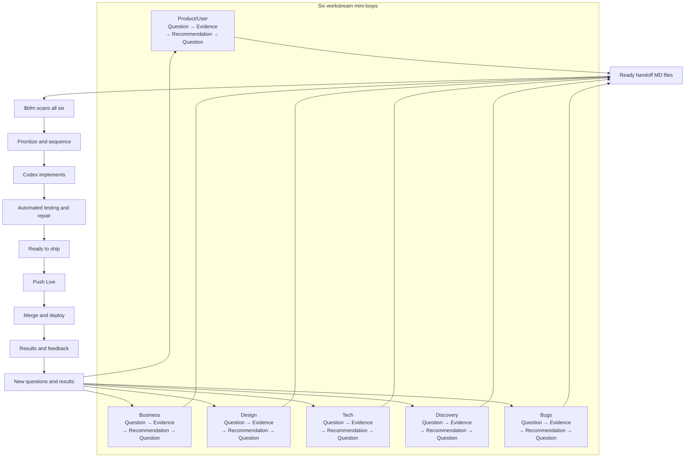

# Why FB

[Overview](../README.md) · [Agile Teams](https://github.com/friedbeef1/fb-lane-coordination/blob/main/docs/fb-for-agile-teams.md) · [Why FB](why-fb.md) · [Full Loop](fb/full-loop.md)

**FB is the product-delivery layer around software execution.** It is useful
when the challenge is not only writing code, but preserving what the user
approved, coordinating the work, checking product quality, and making the next
review step obvious.

> Codex executes software work.
> Capacitor is a session-intelligence platform.
> FB is a product-delivery harness that includes curated session intelligence.

This is a difference in emphasis, not three completely separate categories.
[OpenAI Codex](https://openai.com/codex/) executes software work. [Kurrent
Capacitor](https://capacitor.kurrent.io/docs/getting-started/what-is-capacitor/)
and FB overlap substantially in
session recall, evidence, and evaluation. FB adds a repository-local product
authority and delivery loop around that intelligence.

The following are product-delivery and coordination gaps that can arise around
ordinary Codex use, not defects in Codex itself.

| Codex issue | Codex problem solved by FB |
|---|---|
| Important decisions remain scattered across chats | FB turns actionable decisions and evidence into repository-local handoff MD files. |
| Codex may start building before the goal and boundaries are clear | FB separates planning from implementation and requires an approved brief before `$bfm`. |
| User evidence, decisions, and AI assumptions can become mixed together | Product/User records each category separately before implementation. |
| Outputs from several Codex tasks must be combined manually | `$bfm` scans ready handoffs across all six workstreams, reconciles conflicts, and sequences the work. |
| Failed checks can return responsibility to the user | FB runs automated checks and owns bounded diagnosis and repair. |
| Progress and readiness can be difficult to interpret | FB reports Current, Next, Blocked, optional review links, and Ready to ship. |
| Codex can perform a merge or deployment when instructed, but product approval may be unclear | FB reserves merge and deployment authority for the explicit phrase **Push Live**. |

Evidence by row: 1, 2, 3, and 5 connect to the [TASK-020 feedback
record](https://github.com/friedbeef1/fb-lane-coordination/blob/main/docs/handoffs/TASK-020.md);
4 connects to the [TASK-029 six-workstream handoff](https://github.com/friedbeef1/fb-lane-coordination/blob/main/docs/handoffs/TASK-029.md);
6 connects to
[TASK-024 status evidence](https://github.com/friedbeef1/fb-lane-coordination/blob/main/docs/handoffs/TASK-024.md)
and the [TASK-022 session-ledger evidence](https://github.com/friedbeef1/fb-lane-coordination/blob/main/docs/handoffs/TASK-022.md);
and 7 connects to the approval-boundary feedback in TASK-020. The
[TASK-023 walkthroughs](https://github.com/friedbeef1/fb-lane-coordination/blob/main/docs/evals/TASK-023-walkthroughs.md)
show how failed checks and product-quality gaps remain owned inside the loop.

## Comparison

For the longer human-team mapping, see [Agile Teams](https://github.com/friedbeef1/fb-lane-coordination/blob/main/docs/fb-for-agile-teams.md).

| System | Good because | Gap | How FB addresses the gap |
|---|---|---|---|
| Vanilla Codex | Directly executes clear software tasks. | Decisions, evidence, priorities, verification, and release authority can remain scattered across chats. | FB captures durable handoffs, reconciles six workstreams, verifies the result, and preserves explicit release approval. |
| Git worktrees | Isolate branches and support parallel implementation. | Isolation does not determine what to build, resolve competing recommendations, or verify the product outcome. | FB connects worktree execution to approved priorities, coordinated implementation, and outcome verification. |
| Kurrent Capacitor | Automatically captures, recalls, observes, and evaluates agent sessions. | Session intelligence alone does not define the approved product outcome or own delivery authority and closeout. | FB connects curated evidence to the brief, user decisions, execution authority, testing, and closeout. |
| BMAD | Provides a broad role-based AI development methodology. | A broad methodology can require more process than a focused repository-local Codex delivery loop. | FB provides a smaller loop around ready handoffs, Codex implementation, automated verification, and explicit release approval. |
| FB | Connects six product workstreams to Codex implementation, verification, and delivery. | — | — |

References: [OpenAI Codex](https://openai.com/codex/), [Git
worktree](https://git-scm.com/docs/git-worktree), [Kurrent
Capacitor](https://capacitor.kurrent.io/docs/getting-started/what-is-capacitor/),
and [BMAD](https://github.com/bmad-code-org/BMAD-METHOD).

## When something else is genuinely a better fit

Most product work benefits from FB when decisions, implementation, verification, and release must remain connected. Another tool is a better fit only when one of these narrower conditions describes the primary goal.

| Condition | Better fit | Why |
|---|---|---|
| The task is completely specified, mechanical, disposable, finishable in one session, and needs no durable decisions, coordination, follow-up, sensitive handling, or release governance. | Vanilla Codex | It executes immediately without creating records that will never be reused. |
| A mature engineering organization already owns requirements, prioritization, CI, review, and release—and needs only native branch isolation. | Git worktrees | Worktrees provide isolation without introducing another coordination system. |
| The primary requirement is comprehensive or forensic capture of large volumes of agent-session activity across teams. | Kurrent Capacitor | Capacitor provides richer automatic session telemetry and history than FB’s curated records. |
| The organization explicitly wants a prescribed, role-heavy methodology with formal personas and lifecycle ceremonies. | BMAD | BMAD provides a broader formal methodology than FB’s repository-local delivery loop. |

If these conditions sound unusually specific, they probably are. Ordinary evolving product work still benefits from FB connecting decisions, implementation, verification, and release.

Describe the outcome and use FB normally. FB decides how much coordination, evidence, and verification the situation requires.

## How FB works with your existing stack

These are documented workflows, not built-in automatic adapters.

| Existing tool | Keep using it for | What FB adds | Integration boundary |
|---|---|---|---|
| Vanilla Codex | Reading, editing, running, testing, and explaining software work | Approved product context, coordinated handoffs, verification ownership, and release boundaries | FB is a Codex plugin; Codex remains the execution engine. |
| Git worktrees | Native branch and filesystem isolation for parallel changes | Priorities, ownership, locks, sequencing, and outcome verification | FB may use ordinary Git worktrees; it does not replace Git. |
| Kurrent Capacitor | Automatic session capture, recall, telemetry, and cross-agent history | Curated product truth tied to decisions, scope, acceptance, and closeout | Capacitor can be an optional evidence source. Important conclusions must enter FB handoffs; no automatic integration currently exists. |
| BMAD | Formal discovery, planning, role-based analysis, PRDs, architecture, and UX artifacts | Repository-local delivery, reconciliation, Codex execution, automated checks, and explicit release approval | Approved BMAD artifacts can enter FB as evidence or ready handoffs. FB remains the delivery authority to avoid competing systems of record. |

A team can use BMAD to produce a formal PRD, Capacitor to preserve detailed session history, Git worktrees to isolate parallel implementation, and Codex to write the software. FB connects the approved parts: it turns the PRD and relevant evidence into durable handoffs, sequences work across worktrees, verifies the delivered outcome, and waits for **Push Live**.

FB is fully open source, repository-local, and requires no FB-hosted service.

## Loop engineering in one picture

For the complete operating view, open the [Full FB Loop Diagram](fb/full-loop.md).

## The honest overlap

Capacitor is session-centric. It emphasizes comprehensive automatic history:
what agents did, which tools they used, and how sessions behaved. It may
provide richer session telemetry.

FB is outcome-centric. It also recalls and evaluates agent work through its
[session ledger](fb/sessions.md), checkpoints, Task Receipts, handoffs,
repository recall, and [eval loop](fb/evals.md). Its final record is curated
product truth: the approved brief, user decisions, assumptions, execution
authority, product-quality evidence, and what the user should test next.

FB deliberately avoids requiring comprehensive transcript capture, hosted
storage, or an autonomous evaluation platform. Capacitor could later act as an
optional evidence provider to FB, but it would not replace FB's approved brief,
board, handoff, or closeout authority.

> Capacitor can show that three agents attempted a feature, which tools they
> used, and where they failed. FB can preserve the important parts of those
> attempts too, but its final record emphasizes which user decision governed
> the feature, what was approved, whether the delivered result satisfied it,
> and exactly what the user should test next.

## Pain points FB is designed to address

These are not invented marketing problems. Each one comes from recorded user
feedback or a checked reproduction in this repository.

| Observed pain | Repository evidence | FB response | What the user sees |
|---|---|---|---|
| “I expected a working product” while FB was still planning. | [TASK-020 feedback record](https://github.com/friedbeef1/fb-lane-coordination/blob/main/docs/handoffs/TASK-020.md) | Separate workstream evidence from authorized execution. | Ready handoffs, then `$bfm` reconciliation and execution. |
| “What was I supposed to test?” | [TASK-020 feedback record](https://github.com/friedbeef1/fb-lane-coordination/blob/main/docs/handoffs/TASK-020.md) and [missing-link eval walkthrough](https://github.com/friedbeef1/fb-lane-coordination/blob/main/docs/evals/TASK-023-walkthroughs.md) | Require review evidence before asking for feedback. | **Test This Now** with direct links, exact steps, expected results, pass criteria, and limits. |
| Lanes, BFM, decisions, assumptions, and build scope were unclear. | [TASK-020 feedback record](https://github.com/friedbeef1/fb-lane-coordination/blob/main/docs/handoffs/TASK-020.md) | Explain roles early and preserve the approved choices. | A How FB works card plus separate **Your decisions** and **Assumptions to confirm** sections. |
| Proposed, blocked, building, checking, and complete work were hard to distinguish. | [TASK-020](https://github.com/friedbeef1/fb-lane-coordination/blob/main/docs/handoffs/TASK-020.md) and [TASK-024 status evidence](https://github.com/friedbeef1/fb-lane-coordination/blob/main/docs/handoffs/TASK-024.md) | Tie plain-language progress to technical state and always name the blocker owner and next action. | One visible status and a concrete pause card. |
| Returning to a task required reconstructing decisions, tests, failures, and recovery. | [TASK-022 session-ledger evidence](https://github.com/friedbeef1/fb-lane-coordination/blob/main/docs/handoffs/TASK-022.md) | Keep curated session recaps, checkpoints, Task Receipts, Brief Validation, and repository recall. | A durable answer to what changed, why, what passed, and who acts next. |
| A feature could work technically but still be generic or not useful enough. | [TASK-023 creator-commerce walkthrough](https://github.com/friedbeef1/fb-lane-coordination/blob/main/docs/evals/TASK-023-walkthroughs.md) | Keep the result in Checking, record a Quality Gap, and revise against the approved quality target. | Honest product-quality status and a specific next review candidate. |
| Repeated runtime/worktree rediscovery slowed resumed work. | Canonical source: `docs/handoffs/TASK-026.md`; [TASK-026 two-speed evidence](evidence/TASK-026-two-speed.md) | **project-preflight** plus **matching-worktree-reuse**. | An optional project-owned preflight runs before mutation, and an exact existing worker is resumed instead of rediscovered or duplicated. |
| Nested worktree placement made the execution path harder to trust. | Canonical source: `docs/handoffs/TASK-026.md`; [TASK-026 two-speed evidence](evidence/TASK-026-two-speed.md) | **primary-checkout-placement**. | A new worker is placed under the primary checkout's `.worktrees/` directory, never beneath another linked worktree. |
| Unnecessary broad reruns after documentation-only closeout repeated already-proven work. | Canonical source: `docs/handoffs/TASK-026.md`; [TASK-026 two-speed evidence](evidence/TASK-026-two-speed.md) | **proportional-verification** with verification-checkpoint-reuse. | Changes on the current coordination-only path allowlist can reuse a successful broad checkpoint. Changes outside that allowlist, including ordinary source, runtime, configuration, or test paths, run the broad gate again. |
| Obscured queue state made it difficult to see what was active, ready, or externally blocked. | Canonical source: `docs/handoffs/TASK-026.md`; [TASK-026 two-speed evidence](evidence/TASK-026-two-speed.md) | **compact-queue-status**. | One compact view names Current, Next ready, and External blocks, including explicit empty states. |

## What the delivery loop adds

The product story stays at the loop level shown above. Quick BFM, Full BFM,
verification checkpoint reuse, and safe fallback remain implementation details
in the [workflow guide](fb/workflow.md), not extra product-story branches.

The loop does not promise that every project needs all six workstreams or heavy
ceremony. Matching workstreams contribute actionable evidence; FB keeps its
execution routing private and records **None relevant** only for a required
six-workstream disposition.

## Concrete examples

### Creator-commerce project

A user says, “Build a place where creators sell digital templates.” Vanilla
Codex can start implementing. Capacitor can retain detailed visibility into
the resulting sessions. FB first separates the user's decisions from defaults,
defines the product promise and useful lanes, waits for approval, then connects
the build and evaluation evidence to a direct review plan.

### Three failed agent attempts

Capacitor may be the richer place to inspect the three sessions and their tool
traces. FB's Task Receipt records the failures and reusable recovery lesson,
but Product uses the approved brief to decide whether the next action is an
implementation fix, a brief revision, an eval repair, or environment recovery.

### Functional but generic output

If a creator-commerce recommendation screen runs but gives generic advice, FB
does not call it complete merely because tests pass. It reports **Checking —
product quality target missed**, records the gap and examples, produces a new
candidate, and asks the user to judge the remaining product question through a
new Test This Now packet.

### Corrective patch on an approved task

Suppose an approved status card has one incorrect label. FB can classify that
bounded, unlocked correction internally as a **Quick BFM Patch**, reuse the
matching worktree, and run the project's optional preflight before mutation.
If all changed paths match the current coordination-only allowlist after a
successful broad checkpoint, it can reuse that checkpoint and verify the patch
proportionally. If the scope is uncertain, a lock conflicts, or a change falls
outside that allowlist, such as an ordinary source, runtime, configuration, or
test path, **Safe fallback** returns the work to **Full BFM** and fresh broad
verification.
