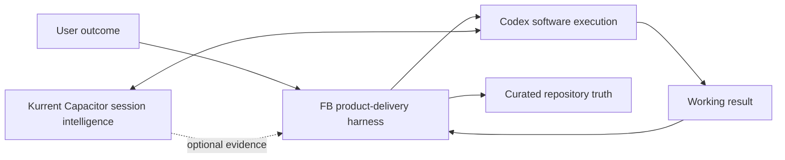
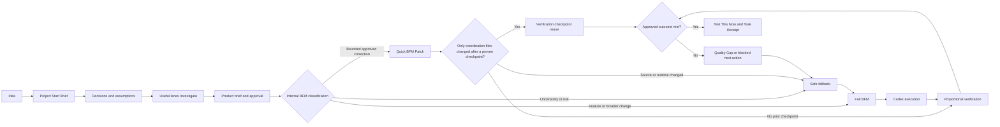

# Why FB

**FB is the product-delivery layer around software execution.** It is useful
when the challenge is not only writing code, but preserving what the user
approved, coordinating the work, checking product quality, and making the next
review step obvious.

> Codex executes software work.  
> Capacitor is a session-intelligence platform.  
> FB is a product-delivery harness that includes curated session intelligence.

This is a difference in emphasis, not three completely separate categories.
[OpenAI Codex](https://openai.com/codex/) executes software work. [Kurrent
Capacitor](https://capacitor.kurrent.io/docs/getting-started/what-is-capacitor/)
and FB overlap substantially in
session recall, evidence, and evaluation. FB adds a repository-local product
authority and delivery loop around that intelligence.

## Strongest emphasis

| System | Strongest emphasis |
|---|---|
| Vanilla Codex | Execute software work |
| Kurrent Capacitor | Automatically capture, observe, recall, and evaluate agent sessions |
| FB | Define, authorize, coordinate, verify, and explain a product outcome |

Use vanilla Codex when the task is small and the desired change is already
clear. Use Capacitor when comprehensive session visibility and automatic
history are the primary need. Use FB when the work needs an approved product
brief, explicit authority, coordinated lanes, durable product truth, quality
gates, or a user-facing test plan. They can be used together.

## The honest overlap

Capacitor is session-centric. It emphasizes comprehensive automatic history:
what agents did, which tools they used, and how sessions behaved. It may
provide richer session telemetry.

FB is outcome-centric. It also recalls and evaluates agent work through its
[session ledger](fb/sessions.md), checkpoints, Task Receipts, handoffs,
repository recall, and [eval loop](fb/evals.md). Its final record is curated
product truth: the approved brief, user decisions, assumptions, execution
authority, product-quality evidence, and what the user should test next.

FB deliberately avoids requiring comprehensive transcript capture, hosted
storage, or an autonomous evaluation platform. Capacitor could later act as an
optional evidence provider to FB, but it would not replace FB's approved brief,
board, handoff, or closeout authority.

> Capacitor can show that three agents attempted a feature, which tools they
> used, and where they failed. FB can preserve the important parts of those
> attempts too, but its final record emphasizes which user decision governed
> the feature, what was approved, whether the delivered result satisfied it,
> and exactly what the user should test next.

## Pain points FB is designed to address

These are not invented marketing problems. Each one comes from recorded user
feedback or a checked reproduction in this repository.

| Observed pain | Repository evidence | FB response | What the user sees |
|---|---|---|---|
| “I expected a working product” while FB was still planning. | [TASK-020 feedback record](https://github.com/friedbeef1/fb-lane-coordination/blob/main/docs/handoffs/TASK-020.md) | Separate planning from authorized execution. | A Project Start Brief, then an explicit `$bfm` build boundary. |
| “What was I supposed to test?” | [TASK-020 feedback record](https://github.com/friedbeef1/fb-lane-coordination/blob/main/docs/handoffs/TASK-020.md) and [missing-link eval walkthrough](https://github.com/friedbeef1/fb-lane-coordination/blob/main/docs/evals/TASK-023-walkthroughs.md) | Require review evidence before asking for feedback. | **Test This Now** with direct links, exact steps, expected results, pass criteria, and limits. |
| Lanes, BFM, decisions, assumptions, and build scope were unclear. | [TASK-020 feedback record](https://github.com/friedbeef1/fb-lane-coordination/blob/main/docs/handoffs/TASK-020.md) | Explain roles early and preserve the approved choices. | A How FB works card plus separate **Your decisions** and **Assumptions to confirm** sections. |
| Proposed, blocked, building, checking, and complete work were hard to distinguish. | [TASK-020](https://github.com/friedbeef1/fb-lane-coordination/blob/main/docs/handoffs/TASK-020.md) and [TASK-024 status evidence](https://github.com/friedbeef1/fb-lane-coordination/blob/main/docs/handoffs/TASK-024.md) | Tie plain-language progress to technical state and always name the blocker owner and next action. | One visible status and a concrete pause card. |
| Returning to a task required reconstructing decisions, tests, failures, and recovery. | [TASK-022 session-ledger evidence](https://github.com/friedbeef1/fb-lane-coordination/blob/main/docs/handoffs/TASK-022.md) | Keep curated session recaps, checkpoints, Task Receipts, Brief Validation, and repository recall. | A durable answer to what changed, why, what passed, and who acts next. |
| A feature could work technically but still be generic or not useful enough. | [TASK-023 creator-commerce walkthrough](https://github.com/friedbeef1/fb-lane-coordination/blob/main/docs/evals/TASK-023-walkthroughs.md) | Keep the result in Checking, record a Quality Gap, and revise against the approved quality target. | Honest product-quality status and a specific next review candidate. |
| Repeated runtime/worktree rediscovery slowed resumed work. | [TASK-026 two-speed evidence](https://github.com/friedbeef1/fb-lane-coordination/blob/main/docs/handoffs/TASK-026.md) | **project-preflight** plus **matching-worktree-reuse**. | An optional project-owned preflight runs before mutation, and an exact existing worker is resumed instead of rediscovered or duplicated. |
| Nested worktree placement made the execution path harder to trust. | [TASK-026 two-speed evidence](https://github.com/friedbeef1/fb-lane-coordination/blob/main/docs/handoffs/TASK-026.md) | **primary-checkout-placement**. | A new worker is placed under the primary checkout's `.worktrees/` directory, never beneath another linked worktree. |
| Unnecessary broad reruns after documentation-only closeout repeated already-proven work. | [TASK-026 two-speed evidence](https://github.com/friedbeef1/fb-lane-coordination/blob/main/docs/handoffs/TASK-026.md) | **proportional-verification** with verification-checkpoint-reuse. | Coordination-only changes can reuse a successful broad checkpoint; source or runtime changes run the broad gate again. |
| Obscured queue state made it difficult to see what was active, ready, or externally blocked. | [TASK-026 two-speed evidence](https://github.com/friedbeef1/fb-lane-coordination/blob/main/docs/handoffs/TASK-026.md) | **compact-queue-status**. | One compact view names Current, Next ready, and External blocks, including explicit empty states. |

## What the delivery loop adds

The loop does not promise that every project needs all four lanes or heavy
ceremony. FB selects the smallest useful mode and keeps normal Codex work
available for simple changes.

## Concrete examples

### Creator-commerce project

A user says, “Build a place where creators sell digital templates.” Vanilla
Codex can start implementing. Capacitor can retain detailed visibility into
the resulting sessions. FB first separates the user's decisions from defaults,
defines the product promise and useful lanes, waits for approval, then connects
the build and evaluation evidence to a direct review plan.

### Three failed agent attempts

Capacitor may be the richer place to inspect the three sessions and their tool
traces. FB's Task Receipt records the failures and reusable recovery lesson,
but Product uses the approved brief to decide whether the next action is an
implementation fix, a brief revision, an eval repair, or environment recovery.

### Functional but generic output

If a creator-commerce recommendation screen runs but gives generic advice, FB
does not call it complete merely because tests pass. It reports **Checking —
product quality target missed**, records the gap and examples, produces a new
candidate, and asks the user to judge the remaining product question through a
new Test This Now packet.

### Corrective patch on an approved task

Suppose an approved status card has one incorrect label. FB can classify that
bounded, unlocked correction internally as a **Quick BFM Patch**, reuse the
matching worktree, and run the project's optional preflight before mutation.
If only coordination Markdown changed after a successful broad checkpoint, it
can reuse that checkpoint and verify the patch proportionally. If the scope is
uncertain, a lock conflicts, or source/runtime files change, **Safe fallback**
returns the work to **Full BFM** and fresh broad verification.
