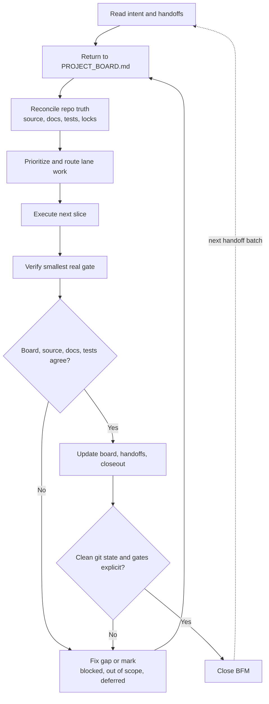

# BFM

BFM is the Build Flow Manager: the Product/Captain mode for turning approved markdown lane plans and handoffs into an executable sequence.
Normal workstream threads are plan-only. Product decides order and gates; Tech, Design, and Business own their planning surfaces. Source changes happen only inside this Product-launched BFM execution run.

## Required Sub-Skills

Use these skills before acting, in this order:

1. `fb-lane`
2. `fb-product`
3. `fb-tech`
4. `fb-design`
5. `fb-business`

## Intake

1. Read `AGENTS.md`, `PROJECT_BOARD.md`, and `.codex/current_task.md` if present.
2. Run `fb_lane_status` or `node tools/fb-lane.cjs status`.
3. Identify the target task from the user request, current task file, board item, or handoff names.
4. Read all prepared markdown that belongs to the target:
   - board-linked files under `docs/handoffs/`
   - `docs/handoffs/<TASK-ID>.md`
   - handoffs named in the target board item's Links, QA, Modified Files, or Latest Update
   - linked `docs/superpowers/plans/` and `docs/superpowers/specs/`
5. If the target is ambiguous, read active `Ready`, `In Progress`, and `Staging QA` board items before choosing.
6. For non-trivial work, read the approved `Goal Alignment Session` block from `PROJECT_BOARD.md` first and treat its Product/workstream OKR plus stable lane OKRs as the source of truth.
7. If the block is missing, stale, pending, or blocking clarity, propose the smallest OKR addition or change in plain language, and stop until the user explicitly approves. Add or change board OKRs only after that approval.
8. Block before execution when approval is missing, OKRs are unclear, a handoff implies an unapproved OKR change, or handoffs conflict with the approved OKR tree.

## Five-Lane Review

Create a short internal review with these slots:

- `FB-Lane`: task state, locks, branch/PR, handoff set, conflicts, missing owner.
- `FB-Product`: user value, approved Product/workstream OKR, stable lane OKRs, sequencing, scope, merge/release gate, beta/staging/live decision.
- `FB-Tech`: implementation dependencies, tests/builds, reliability/security, blocked integrations.
- `FB-Design`: UI/UX dependencies, responsive/visual QA, screenshot evidence, unresolved visual gates.
- `FB-Business`: positioning/copy/pricing/privacy claims, approval state, source integration target.

Do not summarize a lane as done from delivery evidence alone. Use `delivered`, `lane-verification-passed`, `pending-gate`, `blocked`, or `superseded`.
Reconcile every lane's `Lane OKR Fit`, `Mini-loop Evidence`, and `Evidence Against Product OKR` before deciding sequence.
Every handoff BFM reads must end with one closeout status: `implemented`, `already done`, `blocked`, `out of scope`, or `explicitly deferred`.

## Sequence

Produce the next execution order before changing files:

1. Reconcile whether the current approved Product/workstream OKR and stable lane OKRs are still aligned.
2. If work conflicts with approved OKRs, propose alternative approaches, scope, or sequence that align to the existing OKR tree and recommend one. Do not dynamically create or edit OKRs during execution.
3. Prerequisite gate decisions Product must make first.
4. Work that can run in parallel because locks do not overlap.
5. Work that must run serially because it changes shared files or depends on another lane.
6. Verification gates required before merge, staging, or live deploy.
7. Explicit stop points needing user approval, especially unapproved OKRs, live deploys, secrets, payment credentials, or destructive changes.

## Execute

Proceed through the sequence without asking for repeated permission when authority is clear.

- Product/BFM creates or scopes board items, sets direction, and reconciles approved markdown plans.
- Product/BFM blocks before execution if the board Goal Alignment Session is missing, has unclear OKRs, has `Approval: pending`, lacks the user's explicit approval, implies an unapproved OKR change, or a handoff is blocked by OKR ambiguity.
- The BFM execution worker claims task/files before durable writes and executes the work in the owning lane context.
- Respect active locks; do not edit files owned by another active lane.
- Use the owning lane for implementation: Tech for app logic/tests, Design for UI/visual QA, Business for copy/positioning, Product for sequencing/merge/release decisions.
- For source-changing work, prefer lane-owned worktrees or isolated branches so Product stays available for direction, integration, and merge gates.
- After each lane finishes, update its handoff and board status before moving to the next dependent step.
- Product reads all resulting handoffs together, reconciles `Lane OKR Fit`, `Mini-loop Evidence`, and `Evidence Against Product OKR`, and only then sequences merges.
- If a lane's tests, build, Git staging, or browser verification hangs, stop the BFM retry loop and record the task as `pending-gate` or `blocked` with the exact runner/process evidence before resequencing.
- Do not deploy live, add production secrets, change payment credentials, or run destructive operations without explicit current approval.

## Return Checks

Treat BFM as a loop, not a one-way pipeline:

- After reading handoffs, return to `PROJECT_BOARD.md` and confirm every handoff is sequenced, represented, or intentionally deferred.
- After source changes, return to each handoff and confirm the source satisfies the requested contract.
- After tests, return to source, docs, and board; stale copy, missing wiring, or bad assumptions become follow-up work or blockers.
- After board/doc updates, run status again and confirm lane state reflects reality.
- After commit/push, return to `git status` and close only with a clean worktree or a named dirty state.

## Completion Contract

Finish with a Product closeout note:

`Closeout note - <TASK-ID>: <status>. Delivered: ... Evidence: ... Remaining: ... Handoff: docs/handoffs/<TASK-ID>.md.`

Also update `PROJECT_BOARD.md` with final status, links, modified files, checks, risks, and next owner.
If completion is blocked, record the exact blocker and the lane responsible for clearing it.
Do not close BFM until board, source, docs, and tests agree, or every disagreement is marked `blocked`, `out of scope`, or `explicitly deferred`.
