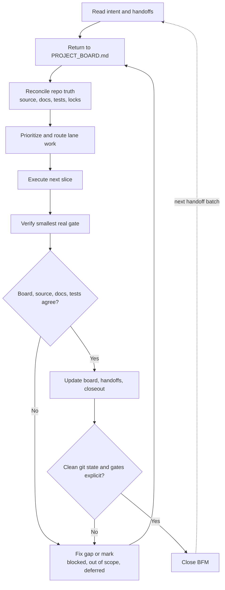

# BFM

BFM is the Build Flow Manager: the Product/Captain mode for turning approved markdown lane plans and handoffs into an executable sequence.
Normal workstream threads are plan-only. Product decides order and gates; Tech, Design, and Business own their planning surfaces. Source changes happen only inside this Product-launched BFM execution run.

## Required Sub-Skills

Use these skills before acting, in this order:

1. `fb-lane`
2. `fb-product`
3. `fb-tech`
4. `fb-design`
5. `fb-business`

## Intake

1. Read `AGENTS.md`, `PROJECT_BOARD.md`, and `.codex/current_task.md` if present.
2. Run `fb_lane_status` or `node tools/fb-lane.cjs status`.
3. Identify the target task from the user request, current task file, board item, or handoff names.
4. Read `docs/handoffs/index.md` if present, then build an all-lane handoff ledger for the target. Check each lane explicitly: `FB-Lane`, `FB-Product`, `FB-Tech`, `FB-Design`, and `FB-Business`.
5. Read only prepared markdown that belongs to the target:
   - board-linked files under `docs/handoffs/`
   - `docs/handoffs/<TASK-ID>.md`
   - handoffs named in the target board item's Links, QA, Modified Files, or Latest Update
   - linked `docs/superpowers/plans/` and `docs/superpowers/specs/`
6. For each lane in the ledger, record one intake state before sequencing: `handoff found`, `no handoff found`, `blocked`, `out of scope`, or `needs Product decision`. Do not skip a lane silently.
7. Before non-quick sequencing, create or refresh `docs/handoffs/index.md` when handoffs exist and the lookup layer is missing, stale, or too vague. Keep `PROJECT_BOARD.md` as truth, the index as routing, and detailed handoffs as detail.
8. Keep the index compact with `Task / Topic`, `Lane`, `Status`, `Depends / Blocks / Gate`, `Checks / Evidence`, and `Detail`. Do not put full OKRs, full QA checklists, plans, logs, rationale, copy variants, or implementation detail in the index.
9. Read relevant `docs/workstreams/<lane>.md` cards after the board and index when revisiting a lane or closing a lane handoff. Treat cards as summaries only, not truth.
10. If the target is ambiguous, read active `Ready`, `In Progress`, and `Staging QA` board items before choosing; do not read every historical handoff unless Product/BFM is doing a full closeout audit.
11. For non-trivial work, read the approved `Goal Alignment Session` block from `PROJECT_BOARD.md` first and treat its Product/workstream OKR plus stable lane OKRs as the source of truth.
12. If the block is missing, stale, pending, or blocking clarity, propose the smallest OKR addition or change in plain language, and stop until the user explicitly approves. Add or change board OKRs only after that approval.
13. Block before execution when approval is missing, OKRs are unclear, a handoff implies an unapproved OKR change, or handoffs conflict with the approved OKR tree. Reuse or clarify the approved OKR; do not generate a fresh OKR for every task.

BFM is not the default mode for simple coding. It is triggered when the objective requires sequencing, approval, merge/release, staging/live, secrets, payments, auth/privacy/analytics, core product flows such as camera/capture/save/export, board-locked files, durable multi-thread context, or multiple lane outputs reconciled before source changes.

Awareness, isolation, integration: `PROJECT_BOARD.md` and `docs/handoffs/index.md` create shared awareness like a standup; branches/worktrees isolate execution like separate desks; BFM integrates outcomes like Product/release review. Worktrees do not replace coordination: no disappearing into a private worktree, no huge unannounced diff, no source edits without board/lock awareness, and no closeout without BFM reconciliation when multiple outputs exist.

## BFM Visible Card and Approval Fix

### Pre-Execution Card Snapshot
Before claiming files, edits, deploys, or completion, show the visible board card snapshot: card ID, status, lane/owner, area, scope, locks, linked handoffs, blockers, gates, checks, branch/PR/staging URL if known, intentional dirty state, and goal details: objective, key results, definition of done, approval state, and justification.

### Goal Approval Gate
If multiple cards match, show the candidates and recommend one. If approval is missing, pending, stale, changed, or unclear, stop and ask. Do not claim files, edit, deploy, or complete before approval.

### Post-Action Card Summary
Before closeout, show card ID, final status, changed files, checks run, remaining gates, next owner, and whether live deploy is still blocked.

## Five-Lane Review

Create a short internal review with these slots:

- `FB-Lane`: task state, locks, branch/PR, handoff set, conflicts, missing owner.
- `FB-Product`: user value, approved Product/workstream OKR, stable lane OKRs, sequencing, scope, merge/release gate, beta/staging/live decision.
- `FB-Tech`: implementation dependencies, tests/builds, reliability/security, blocked integrations.
- `FB-Design`: UI/UX dependencies, responsive/visual QA, screenshot evidence, unresolved visual gates.
- `FB-Business`: positioning/copy/pricing/privacy claims, approval state, source integration target.

Show these five slots in the chat stream for BFM runs. Each slot must name the handoff files found or state `no handoff found`.
Do not summarize a lane as done from delivery evidence alone. Use `delivered`, `lane-verification-passed`, `pending-gate`, `blocked`, or `superseded`.
Reconcile every lane's `Workstream Goal`, `Lane OKR Fit`, `User Approval Needed`, `Mini-loop Evidence`, and `Evidence Against Product OKR` before deciding sequence.
Every handoff BFM reads must end with one closeout status: `implemented`, `already done`, `blocked`, `out of scope`, or `explicitly deferred`.
Also assign one loop health flag: `healthy`, `watch`, `needs Product review`, or `blocked`. Use this instead of numeric loop scoring.
Also record `Loop Learning`: feedback captured, repeated pattern (`no|yes`), tooling needed (`none|propose guardrail|propose automation|propose eval`), and Product approval needed (`no|yes`).

## Story Split Pass

Before prioritizing or sequencing a BFM run, decide whether the request should be split into smaller stories. Split when the batch mixes unrelated lanes, risks, locks, gates, review surfaces, blocked work, and ready-now work. If splitting helps, show the proposed child stories with owner/lane, scope, dependencies, locks/gates, and recommended order. If no split helps, say `No split needed` and continue.

Do not split tiny single-file quick fixes unless it removes a real blocker, ownership mismatch, or review-gate mismatch. After the split decision, run the Dependency And Lock Pass on the resulting stories or on the original item if no split is needed.

## Dependency And Lock Pass

Before sequencing, classify each five-lane ledger item. Capture status, owner, locks, dependencies, blockers, gates, approval, and required checks. Assign exactly one classification: `ready now`, `blocked by lock`, `blocked by dependency`, `needs Product decision`, `out of scope`, or `explicitly deferred`.

## Sequence

Produce the next execution order before changing files:

1. Reconcile whether the current approved Product/workstream OKR and stable lane OKRs are still aligned.
2. Run the Story Split Pass before prioritizing; either show child stories or state `No split needed`.
3. If work conflicts with approved OKRs, propose alternative approaches, scope, or sequence that align to the existing OKR tree and recommend one. Do not dynamically create or edit OKRs during execution.
4. Sequence all five lane ledger entries: execute aligned handoffs, mark missing lane handoffs as `no handoff found`, and explicitly defer, block, or route anything outside the approved goal.
5. Prerequisite gate decisions Product must make first.
6. Work that can run in parallel because locks do not overlap.
7. Work that must run serially because it changes shared files or depends on another lane.
8. Verification gates required before merge, staging, or live deploy.
9. Explicit stop points needing user approval, especially unapproved OKRs, live deploys, secrets, payment credentials, or destructive changes.

## Unblocked Sequence

Execute only `ready now` items. Do not claim or touch files locked by another active lane. If work overlaps locked files, split independent unlocked work or defer with the blocking task named. If everything is blocked, stop with the recommended next unblock action.

## Execute

Proceed through the sequence without asking for repeated permission when authority is clear.

- Product/BFM creates or scopes board items, sets direction, and reconciles approved markdown plans.
- Product/BFM blocks before execution if the board Goal Alignment Session is missing, has unclear OKRs, has `Approval: pending`, lacks the user's explicit approval, implies an unapproved OKR change, or a handoff is blocked by OKR ambiguity.
- The BFM execution worker claims task/files before durable writes and executes the work in the owning lane context.
- Respect active locks; do not edit files owned by another active lane.
- Use the owning lane for implementation: Tech for app logic/tests, Design for UI/visual QA, Business for copy/positioning, Product for sequencing/merge/release decisions.
- For source-changing work, prefer lane-owned worktrees or isolated branches so Product stays available for direction, integration, and merge gates.
- Before source execution, confirm board/status/locks and the relevant handoff index; during isolated work, name the task, branch/worktree, lane, and locked files.
- After each lane finishes, update its handoff and board status before moving to the next dependent step.
- After executing or explicitly deferring a lane handoff, refresh the relevant `docs/workstreams/<lane>.md` card with the current summary, already-executed Product/BFM work, pending or blocked work, and evidence links.
- Product reads all resulting handoffs together, reconciles `Workstream Goal`, `Lane OKR Fit`, `User Approval Needed`, `Mini-loop Evidence`, and `Evidence Against Product OKR`, and only then sequences merges.
- Continue the BFM loop until every discovered lane handoff is `implemented`, `already done`, `blocked`, `out of scope`, or `explicitly deferred`, and every lane with no matching handoff is recorded as `no handoff found`.
- If a lane's tests, build, Git staging, or browser verification hangs, stop the BFM retry loop and record the task as `pending-gate` or `blocked` with the exact runner/process evidence before resequencing.
- Do not deploy live, add production secrets, change payment credentials, or run destructive operations without explicit current approval.

## Recheck Before Claim

Rerun lane status immediately before claiming or editing. If locks changed, resequence instead of using stale assumptions.

## Return Checks

Treat BFM as a loop, not a one-way pipeline:

- After reading handoffs, return to `PROJECT_BOARD.md` and confirm every handoff is sequenced, represented, or intentionally deferred.
- After source changes, return to each handoff and confirm the source satisfies the requested contract.
- After tests, return to source, docs, and board; stale copy, missing wiring, or bad assumptions become follow-up work or blockers.
- After board/doc updates, run status again and confirm lane state reflects reality.
- After commit/push, return to `git status` and close only with the branch/worktree named as clean, merged, stale, blocked, or intentionally dirty.

## Proactive Loop Hardening

When repeated workflow failure, coordination friction, stale state, missing evidence, or preventable rework appears, propose one small guardrail before closing or starting the next source task.

Include the observed pattern, recommended guardrail, cost, benefit, files/rules affected, and approval needed. Do not silently change docs, rules, templates, or automation. Skip one-off or low-impact issues.

Use the closeout `Loop Learning` field as the escalation trigger. Choose `none` for one-off friction, `propose guardrail` for repeated process misses, `propose automation` for repeated manual checks, and `propose eval` for repeated agent-behavior failures.

When it chooses `propose eval`, propose a small Markdown scorecard under `docs/evals/` using the generic sections from `docs/evals/agent-behavior-scorecard-template.md`. Do not create an eval runner, dashboard, numeric score, CI eval job, or larger `doctor` rule unless that heavier option is separately approved.

## Approval Autonomy Phases

Start in Phase 1 Shadow Approval: ask the user, but record `Would self-approve: yes/no` and the reason. Recommend Phase 2 after one day or three matching decisions with no material miss. Recommend Phase 3 after five safe self-approvals with no rollback, stale dirty state, or hidden gate. The user approves phase changes.

Bounded self-approval applies only to low-risk continuation work that fits the approved OKR and Definition of Done. Never self-approve new scope, new OKRs, live deploys, secrets, payments, auth/privacy, destructive data, provider-state changes, unclear goals, failed evidence, lock conflicts, or unresolved dirty state. Workstreams may mark `safe to auto-accept`; Product/BFM owns actual self-approval.

Once the user has approved a safe Product/BFM task or problem, keep going through routine diagnosis, implementation, verification, board/handoff updates, commit, staging, and cleanup until solved or explicitly blocked. Report after closeout, not before every routine step. Stop and ask only for live deploy, secrets/credentials, payments, auth/privacy, destructive data or provider-state changes, new scope or OKR changes, unclear goals, lock conflicts, failed evidence that needs risk acceptance, or an explicit user pause.

`/goal` is a Product/BFM shortcut into the existing Goal Alignment Session. Use it to show, create, clarify, or ask approval for the current goal. Do not create a second goal system or a `/goals` flow. Workstream chats should put proposed workstream goals in handoffs for Product/BFM to reconcile.

## Completion Contract

Finish with a Product closeout note:

`Closeout note - <TASK-ID>: <status>. Health: <healthy|watch|needs Product review|blocked>. Delivered: ... Evidence: ... Remaining: ... Handoff: docs/handoffs/<TASK-ID>.md.`

Add `Loop Learning: Feedback captured: <none|issue found>; Repeated pattern?: <no|yes>; Tooling needed?: <none|propose guardrail|propose automation|propose eval>; Product approval needed?: <no|yes>.`

Also update `PROJECT_BOARD.md` with final status, links, modified files, checks, risks, and next owner.
Also update the relevant `docs/workstreams/<lane>.md` card when closeout changes what that lane needs to know later.
If completion is blocked, record the exact blocker and the lane responsible for clearing it.
Do not close BFM until board, source, docs, and tests agree, or every disagreement is marked `blocked`, `out of scope`, or `explicitly deferred`.
